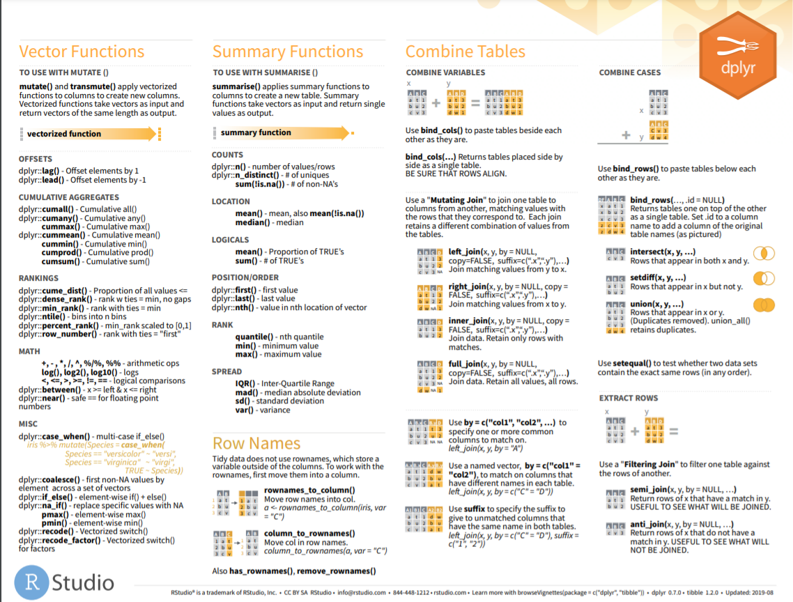

# Data Management in R

```{r mind map,echo = F,message = FALSE, error = FALSE, warning = FALSE}
library('mindr')
### text -> widget
### input <- c("# Chapter 1", "## Section 1.1", "### Section 1.1.1", "## Section 1.2", "# Chapter 2")
### mm(from = input, type = "text", root = "mindr")
filename <- rstudioapi::getSourceEditorContext()$path
widget <- mm(from = filename, type = "file", root = "")
widget
```

## Package tidyr 

### CHEAT SHEET

```{r tidyr-cheat-sheet, echo=FALSE, fig.align="center", out.width = '100%',fig.cap="Data Wrangling with dplyr and tidyr"}
knitr::include_graphics("./02_Plots/tidyr_sheet1.png")
knitr::include_graphics("./02_Plots/tidyr_sheet2.png")
```


### Pivoting

* One variable might be spread across multiple columns. 
* One observation might be scattered across multiple rows. 
    + `pivot_longer()`
    + `pivot_wider()`
    
```{r pivot_longer,echo = T,message = FALSE, error = FALSE, warning = FALSE}
library("tidyr")
table4a

table4a %>% 
  pivot_longer(c(`1999`, `2000`), names_to = "year", values_to = "cases")
```

```{r pivot_wider, echo = T,message = FALSE, error = FALSE, warning = FALSE}
table2

table2 %>%
    pivot_wider(names_from = type, values_from = count)


## missing values
## last observation carried forward
treatment <- tribble(
  ~ person,           ~ treatment, ~response,
  "Derrick Whitmore", 1,           7,
  NA,                 2,           10,
  NA,                 3,           9,
  "Katherine Burke",  1,           4
)

treatment %>% 
  fill(person)
```

### gather and spread


```{r gather spread,echo = T,message = FALSE, error = FALSE, warning = FALSE}
## prepare data
olddata_wide <- read.table(header=TRUE, text='
 subject sex control cond1 cond2
       1   M     7.9  12.3  10.7
       2   F     6.3  10.6  11.1
       3   F     9.5  13.1  13.8
       4   M    11.5  13.4  12.9
')
olddata_wide$subject <- factor(olddata_wide$subject)

olddata_long <- read.table(header=TRUE, text='
 subject sex condition measurement
       1   M   control         7.9
       1   M     cond1        12.3
       1   M     cond2        10.7
       2   F   control         6.3
       2   F     cond1        10.6
       2   F     cond2        11.1
       3   F   control         9.5
       3   F     cond1        13.1
       3   F     cond2        13.8
       4   M   control        11.5
       4   M     cond1        13.4
       4   M     cond2        12.9
')
olddata_long$subject <- factor(olddata_long$subject)

## factor_key将新键列视为一个因子（而不是字符向量）
data_long <- gather(olddata_wide, condition, measurement, control:cond2, factor_key=TRUE)

##########################################################
#                     Äquivalent                         #
keycol <- "condition"                                    #
valuecol <- "measurement"                                #
gathercols <- c("control", "cond1", "cond2")             #
gather_(olddata_wide, keycol, valuecol, gathercols)      #
##########################################################

data_wide <- spread(data=olddata_long, key = condition, value = measurement, convert = T)
data_wide %>% str
```

### separate and unite


```{r separate unite ,echo = T,message = FALSE, error = FALSE, warning = FALSE}
table3

table3 %>% 
  separate(rate, into = c("cases", "population"), sep = "/")

table3 %>% 
  separate(year, into = c("century", "year"), sep = 2)

table5 %>% 
  unite(new, century, year)

table5 %>% 
  unite(new, century, year, sep = "")
```


## Package dplyr 

[Package ‘dplyr’](https://cran.r-project.org/web/packages/dplyr/dplyr.pdf)

### CHEAT SHEET

```{r dplyr-cheat-sheet, echo=FALSE, fig.align="center", out.width = '100%',fig.cap="Data Transformation with dplyr"}
knitr::include_graphics("./02_Plots/data_transformation1.png")

```


### across


```{r across function,echo = T,message = FALSE, error = FALSE, warning = FALSE}
library("dplyr")
iris %>%
    as_tibble() %>%
    mutate(across(c(Sepal.Length, Sepal.Width), round))
```

### arrange


```{r arrange function,echo = T,message = FALSE, error = FALSE, warning = FALSE}
## Missing values are always sorted at the end:
data("flights",package="nycflights13")
arrange(flights, year, month, day)

## in descending order:
arrange(flights, desc(dep_delay))

## group_by
by_cyl <- mtcars %>% group_by(cyl)    
## 无视之前的分组            
by_cyl %>% arrange(desc(wt))    
   
## 在之前的分组内再排序    
by_cyl %>% arrange(desc(wt), .by_group = TRUE) 
```

### coalesce

```{r coalesce function,echo = T,message = FALSE, error = FALSE, warning = FALSE}
# Or match together a complete vector from missing pieces
y <- c(1, 2, NA, NA, 5)
z <- c(NA, NA, 3, 4, 5)
coalesce(y, z)

# Supply lists by with dynamic dots
vecs <- list(
  c(1, 2, NA, NA, 5),
  c(NA, NA, 3, 4, 5)
)
coalesce(!!!vecs)
```

### filter

```{r filter function,echo = T,message = FALSE, error = FALSE, warning = FALSE}
data("flights",package="nycflights13")
filter(flights, month == 1, day == 1)
filter(flights, month == 11 | month == 12)
filter(flights, month %in% c(11, 12))    

## Missing values,use is.na(x)
df <-  tibble(x = c(1, NA, 3))
filter(df, is.na(x) | x > 1) 
```

### if_else


```{r if_else function,echo = T,message = FALSE, error = FALSE, warning = FALSE}
x <- factor(sample(letters[1:5], 10, replace = TRUE))
ifelse(x %in% c("a", "b", "c"), x, factor(NA))
## 与ifelse不同，if_else保留类型
if_else(x %in% c("a", "b", "c"), x, factor(NA))
```

### join


```{r join function,echo = T,message = FALSE, error = FALSE, warning = FALSE}
## left join: 共有
## full join: 全部
## left join: 以左边为主

## 选取变量 left join
data("flights",package="nycflights13")
data("airlines",package="nycflights13")
data("weather",package="nycflights13")

flights2 <- flights %>% 
  select(year:day, hour, origin, dest, tailnum, carrier)
head(flights2)  
```


### mutate

```{r mutate function,echo = T,message = FALSE, error = FALSE, warning = FALSE}
## mutate()
flights_sml <- select(flights, 
  year:day, 
  ends_with("delay"), 
  distance, 
  air_time
) 
```


### select

```{r select function,echo = T,message = FALSE, error = FALSE, warning = FALSE}
data("flights",package="nycflights13")
select(flights, year, month, day)
select(flights, year:day)
select(flights, -(year:day))

    ## 辅助函数 helper functions can use within select():
       ## starts_with("abc"): matches names that begin with “abc”.
       ## ends_with("xyz"): matches names that end with “xyz”.
       ## contains("ijk"): matches names that contain “ijk”.
       ## num_range("x", 1:3): matches x1, x2 and x3.
    ## ignore.case选项表示忽略大小写。
select(iris, contains("etal", ignore.case = TRUE))

    ## 将几个变量移到数据框的开头
select(flights, time_hour, air_time, everything())

    ## rename
rename(flights, tail_num = tailnum)
```


### summarise

```{r summarise function,echo = T,message = FALSE, error = FALSE, warning = FALSE}
## with group_by
by_day <- group_by(flights, year, month, day)
summarise(by_day, delay = mean(dep_delay, na.rm = TRUE))


## pipe, %>%:
delays <- flights %>% 
  group_by(dest) %>% 
  summarise(
    count = n(),
    dist = mean(distance, na.rm = TRUE),
    delay = mean(arr_delay, na.rm = TRUE)
  ) %>% 
  filter(count > 20, dest != "HNL")
delays


## 进行任何汇总时，最好都包含一个计数（n（））或一个非缺失值的计数
## count=n(),
## non_miss=sum(!is.na(arr_delay)),

## quo()函数来求多值, “!!!”是引用终值并解析操作符，使用对象为元素为引用的列表或向量，它将引用的表达式解析并计算，每个列表元素都释放为summarize()函数的参数。另有“!!”操作符针对非列表对象
data("cuckoos", package = "DAAG")
var <- list(quo(mean(length)), quo(sd(length)),
            quo(mean(breadth)), quo(sd(breadth)))
cuckoos %>%
  group_by(species) %>%
  summarise(!!! var)
  
## Äquivalent
cuckoos %>%
  group_by(species) %>%
  summarise(mw_length = mean(length),
            mw_breadth = mean(breadth)) %>%
  arrange(mw_length, mw_breadth)
```


## Package readr 

### CHEAT SHEET

```{r readr, echo=FALSE, fig.align="center", out.width = '100%',fig.cap="Data Import: CHEAT SHEET"}
knitr::include_graphics("./02_Plots/readr_sheet1.png") 
knitr::include_graphics("./02_Plots/readr_sheet2.png") 
```


## Package stringr

### CHEAT SHEET

```{r stringr, echo=FALSE, fig.align="center", out.width = '100%',fig.cap="strings with stringr: CHEAT SHEET"}
knitr::include_graphics("./02_Plots/stringr_sheet1.png") 
knitr::include_graphics("./02_Plots/stringr_sheet2.png") 
```

## Package forcats

### CHEAT SHEET

```{r forcats, echo=FALSE, fig.align="center", out.width = '100%',fig.cap="Factors with forcats: CHEAT SHEET"}
knitr::include_graphics("./02_Plots/forcats_sheet1.png") 
```


## Package lubridate

### CHEAT SHEET

```{r lubridate, echo=FALSE, fig.align="center", out.width = '100%',fig.cap="Dates and times with lubridate: CHEAT SHEET"}
knitr::include_graphics("./02_Plots/lubridate_sheet1.png")
knitr::include_graphics("./02_Plots/lubridate_sheet2.png")
```

