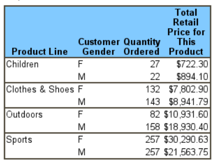
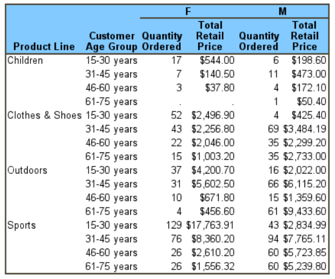

# Descriptive Statistics in SAS


```{r mind map,echo = F,message = FALSE, error = FALSE, warning = FALSE}
library('mindr')
### text -> widget
### input <- c("# Chapter 1", "## Section 1.1", "### Section 1.1.1", "## Section 1.2", "# Chapter 2")
### mm(from = input, type = "text", root = "mindr")
filename <- rstudioapi::getSourceEditorContext()$path
widget <- mm(from = filename, type = "file", root = "")
widget
```


## PROC FREQ

```
PROC FREQ <options> ;

  BY variables;
  EXACT statistic-options </ computation-options> ;
  OUTPUT <OUT=SAS-data-set> output-options;
  TABLES requests </ options> ;
  TEST options;
  WEIGHT variable </ option> ;
```

### ODS Table Names

See more ["ODS Table Names"](https://documentation.sas.com/doc/en/statcdc/14.2/statug/statug_freq_details116.htm)

| ODS Table Name    | Description                            | Statement | Option           |
|-------------------|----------------------------------------|-----------|------------------|
| BinomialCLs       | Binomial confidence limits             | TABLES    | BINOMIAL(CL=)    |
| BinomialEquivTest | Binomial equivalence test              | TABLES    | BINOMIAL(EQUIV)  |
| BinomialNoninf    | Binomial noninferiority test           | TABLES    | BINOMIAL(NONINF) |
| BinomialTest      | Binomial proportion test               | TABLES    | BINOMIAL         |
| CMH               | Cochran-Mantel-Haenszel test           | TABLES    | CMH              |
| ChiSq             | Chi-square tests                       | TABLES    | CHISQ            |
| EqualKappaTests   | Tests for equal kappas                 | TABLES    | AGREE            |
| EqualOddsRatios   | Tests for equal odds ratios            | EXACT     | EQOR             |
| GammaTest         | Gamma test                             | TEST      | GAMMA            |
| LRChiSq           | Likelihood ratio chi-square exact test | EXACT     | LRCHI            |
| MHChiSq           | Mantel-Haenszel chi-square exact test  | EXACT     | MHCHI            |
| OneWayChiSq       | One-way chi-square test                | TABLES    | CHISQ            |
| PearsonCorr       | Pearson correlation                    | TEST      | PCORR            |


### ODS Plots

| ODS Graph Name | Description               | PLOTS= Option | TABLES Statement Option           |
|----------------|---------------------------|---------------|-----------------------------------|
| AgreePlot      | Agreement plot            | AGREEPLOT     | AGREE                             |
| CumFreqPlot    | Cumulative frequency plot | CUMFREQPLOT   | One-way table request             |
| DeviationPlot  | Deviation plot            | DEVIATIONPLOT | CHISQ (one-way table)             |
| FreqPlot       | Frequency plot            | FREQPLOT      | Any table request                 |
| KappaPlot      | Kappa plot                | KAPPAPLOT     | AGREE                             |
| MosaicPlot     | Mosaic plot               | MOSAICPLOT    | Two-way or multiway table request |
| ORPlot         | Odds ratio plot           | ODDSRATIOPLOT | MEASURES, OR, or RELRISK          |
| RelRiskPlot    | Relative risk plot        | RELRISKPLOT   | MEASURES or RELRISK               |
| RiskDiffPlot   | Risk difference plot      | RISKDIFFPLOT  | RISKDIFF ( table)                 |
| WtKappaPlot    | Weighted kappa plot       | WTKAPPAPLOT   | AGREE                             |
| PearsonCorr    | Pearson correlation       | TEST          | PCORR                             |


## PROC UNIVARIATE

### HISTOGRAM Statement

The HISTOGRAM statement creates histograms and optionally superimposes estimated **parametric and nonparametric** probability density curves. 

**ODS Tables Produced with the HISTOGRAM Statement**

| ODS Table Name     |                  Description                  |            Option            |
|--------------------|:---------------------------------------------:|:----------------------------:|
| Bins               |                 Histogram bins                | MIDPERCENTS secondary option |
| FitQuantiles       |        Quantiles of fitted distribution       |    Any distribution option   |
| GoodnessOfFit      | Goodness-of-fit tests for fitted distribution |    Any distribution option   |
| HistogramBins      |                 Histogram bins                |      MIDPERCENTS option      |
| ParameterEstimates |  Parameter estimates for fitted distribution  |    Any distribution option   |


### CDFPLOT Statement

The CDFPLOT statement plots the observed cumulative distribution function (CDF) of a variable The CDF is defined as
$$
\begin{aligned}
F_{N}(x) &=\text { percent of nonmissing values } \leq x \\
&=\frac{\text { number of values } \leq x}{N} \times 100 \%
\end{aligned}
$$

* [Distribution Options](https://documentation.sas.com/doc/it/pgmsascdc/9.4_3.5/procstat/procstat_univariate_syntax03.htm)
* General Options

```
proc univariate data=Steel;
   var Length Width;
   cdfplot Width / normal(mu=10 sigma=0.5);
run;
```

### PPPLOT Statement

The PPPLOT statement creates a probability-probability plot (also called a P-P plot or percent plot), which compares the empirical cumulative distribution function (ECDF) of a variable with a specified theoretical cumulative distribution function such as the normal. If the two distributions match, the points on the plot form a linear pattern that passes through the origin and has unit slope. 

Specify one of the following theoretical distributions

* beta
* exponential
* gamma
* Gumbel
* generalized Pareto
* inverse Gaussian
* lognormal
* normal
* ...
* Weibull

### PROBPLOT and QQPLOT Statement

The PROBPLOT statement creates a probability plot, which compares ordered variable values with the percentiles of a specified theoretical distribution. If the data distribution matches the theoretical distribution, the points on the plot form a linear pattern. Consequently, you can use a probability plot to determine how well a theoretical distribution models a set of measurements.

The QQPLOT statement creates quantile-quantile plots (Q-Q plots) and compares ordered variable values with quantiles of a specified theoretical distribution. If the data distribution matches the theoretical distribution, the points on the plot form a linear pattern. Thus, you can use a Q-Q plot to determine how well a theoretical distribution models a set of measurements.

### ODS Tables   

| ODS Table Name    |                         Description                         |              Option              |
|-------------------|:-----------------------------------------------------------:|:--------------------------------:|
| BasicIntervals    | Confidence intervals for mean, standard deviation, variance |              CIBASIC             |
| BasicMeasures     |             Measures of location and variability            |              Default             |
| ExtremeObs        |                     Extreme observations                    |              Default             |
| ExtremeValues     |                        Extreme values                       |             NEXTRVAL=            |
| Frequencies       |                         Frequencies                         |               FREQ               |
| LocationCounts    |        Counts used for sign test and signed rank test       |             LOCCOUNT             |
| MissingValues     |                        Missing values                       | Default, if missing values exist |
| Modes             |                            Modes                            |               MODES              |
| Moments           |                        Sample moments                       |              Default             |
| Plots             |                  Legacy line printer plots                  |               PLOTS              |
| Quantiles         |                          Quantiles                          |              Default             |
| RobustScale       |                   Robust measures of scale                  |            ROBUSTSCALE           |
| SSPlots           |          Legacy line printer side-by-side box plots         |     PLOTS (with BY statement)    |
| TestsForLocation  |                      Tests for location                     |              default             |
| TestsForNormality |                     Tests for normality                     |            NORMALTEST            |
| TrimmedMeans      |                        Trimmed means                        |             TRIMMED=             |
| WinsorizedMeans   |                       Winsorized means                      |            WINSORIZED=           |


### ODS Graphics

| ODS Graph Name | Plot Description | Statement |
|----------------|------------------|-----------|
| CDFPlot        | CDF plot         | CDFPLOT   |
| Histogram      | Histogram        | HISTOGRAM |
| PPPlot         | P-P plot         | PPPLOT    |
| ProbPlot       | Probability plot | PROBPLOT  |
| QQPlot         | Q-Q plot         | QQPLOT    |


## PROC MEANS

### Basic summary statistics

```
ods select none;
		proc means data=data_in  stackodsoutput n nmiss min max mean median std q1 q3 maxdec=3 completetypes missing order=data ; 
			var var1 ... CFB CFM1;	
			class classvar1 classvar2 ...;
			ods output  summary = data_out ; 
		run;
		ods select all;
```

### AUTONAME Option

```
proc means noprint proc
  data=x.electricity;
  class division serial;
  var kwh1 rev1;
  output out=new4 mean(kwh1) = sum(rev1) =/autoname;
run;
```


### CHARTYPE Option

By using the CHARTYPE option, the analyst easily creates the three desired data sets in a single use of PROC MEANS.

```
proc means noprint data=order.orderfile2 CHARTYPE;
  class mailcode deptnbr segment status;
  var itmprice itm_qty;
  output out=one(where=(_type = '1001')) sum=;
  output out=two(where=(type = '1011')) sum=;
  output out=three(where=(type = '0110')) sum = ;
run;
```

**DESCENDTYPES Option**

The new DESCENDTYPES option, which is placed in the PROC MEANS statement, instructs the procedure to order observations in the output data sets it creates in descending value of TYPE. This option is very handy if you want the observation with TYPE = 0 at the bottom of your data set, rather than at the top.


## PROC TABULATE 

### Basic Syntax for PROC TABULATE

```
 PROC TABULATE <option-list>;
   CLASS class-variable-list;
   VAR analysis-variable-list;
   TABLE <<page-expression,> row-expression,>
   column-expression </ table-option-list>;
   BY <NOTSORTED> <DESCENDING> variable-1
   < … <DESCENDING> variable-n>;
   FORMAT variable-list-1 format-1
   < … variable-list-n format-n>;
   FREQ variable;
   KEYLABEL keyword-1=‘description-1’
   < … keyword-n=“description-n’>;
   LABEL variable-1=‘label-1’ <…variable-n=‘label-n’>;
   WEIGHT variable;
 TITLE ‘text’;
```

### Identification of Desired Statistics

* N = the number of observations, the frequency count,
* MIN = the smallest value,
* MAX = the largest value,
* MEAN = the arithmetic mean, or the average,
* STD = the standard deviation,
* VAR = the variance,
* SUM = the sum of the values,
* PCTN = the percentage that one frequency is of another frequency,
* PCTSUM = the percentage that one sum is of another sum,

### In processing


## SAS Macro

### %Multisummary

The MULTISUMMARY macro produces an output data set containg any of the statistics calculated by PROC SUMMARY for any number of numeric variables.

|  Var     |  Des.                                                                                                                                                                                              |   |
|----------|----------------------------------------------------------------------------------------------------------------------------------------------------------------------------------------------------|---|
|  DATA=   |  The name of the input data set [Default: DATA=_LAST_]                                                                                                                                             |   |
|  VAR=    |  The name of the variable to be analyzed [Default: VAR=_NUMERIC_]                                                                                                                                  |   |
|  CLASS=  |  Name(s) of 0 or more class variables                                                                                                                                                              |   |
|  STATS=  | List of names of the output statistics to calculate, e.g., MEAN, MEDIAN, Q1, Q3, etc. Any of the statistic keywords accepted by PROC SUMMARY.                                                      |   |
| Options= | Options for PROC SUMMARY, e.g., nway, missing...                                                                                                                                                   |   |
|  OUT=    |  The name of the output data set. The observations in this data set correspond to the combinations of the levels of all class variables with the set of statistics specified in the STATS= option. |   |

```
%macro words(string,root=);
%*--------------------------------------------------;
%* Return number of words in string. If root ^' ',  ;
%* then create global variables starting with root. ;
%*--------------------------------------------------;
   %local count word;
   %let count=1;
   %let word = %scan(&string,&count,%str( ));
   %do %while(%quote(&word)^= );
	%*put WORDS: word=&word;
       %if &root^=  %then %do;
          %global &root&count;
          %let &root&count=&word;
       %end;
       %let count = %eval(&count+1);
       %let word = %scan(&string,&count,%str( ));
   %end;
   %eval(&count-1)
%mend words;
/******************************************************
%put words() = %words(hhh ggg);
%put words = %words(A B C,root=W);
******************************************************/

%macro multisummary(
	data=_last_,    /* name of input data set */
	var=_numeric_,  /* names of analysis variables                      */
	class=,         /* name(s) of  0 or more class variables            */
	stats=,         /* names of output statistics to calculate          */
	options=,       /* options for proc summary, e.g., nway, missing... */
	out=
	);

%let nstat=%words(&stats);

options nonotes;
proc datasets nolist nowarn;
	delete &out;

%do i=1 %to &nstat;
	%let stat=%scan(&stats, &i);
	proc summary data=&data &options;
	%if %length(&class) %then %do;
		class &class;
		%end;
	var &var;
	output out=_out  &stat= ;

	data _out;
		length _statistic_ $8;
		set _out;
		_statistic_ = "&stat";
		label _statistic_ = 'Name of statistic';
	
	proc append base=&out new=_out;
	run;
	%end;

%if %length(&class) %then %do;
proc sort data=&out;
	by &class;
	%end;

proc datasets nolist nowarn;
	delete _out;
options notes;

%mend multisummary;

%multisummary(data=Inbonta_analysis_fasaq, var=Q_8, class = visit, stats=n mean std MEAN MEDIAN Q1 Q3, options=missing, OUT=T14_3_6_1_fasaqQ8);	
```

| _statistic_ | visit | _TYPE_ | _FREQ_ | Q_8     |
|-------------|-------|--------|--------|---------|
| n           | .     | 0      | 165    | 165.000 |
| mean        | .     | 0      | 165    | -1.933  |
| std         | .     | 0      | 165    | 3.843   |
| MEAN        | .     | 0      | 165    | -1.933  |
| MEDIAN      | .     | 0      | 165    | 0.000   |
| Q1          | .     | 0      | 165    | -5.000  |
| Q3          | .     | 0      | 165    | 0.000   |
| n           | 2     | 1      | 33     | 33.000  |
| mean        | 2     | 1      | 33     | -0.485  |
| std         | 2     | 1      | 33     | 4.086   |
| MEAN        | 2     | 1      | 33     | -0.485  |
| MEDIAN      | 2     | 1      | 33     | 0.000   |
| Q1          | 2     | 1      | 33     | -3.000  |
| Q3          | 2     | 1      | 33     | 2.000   |
| n           | 3     | 1      | 33     | 33.000  |
| mean        | 3     | 1      | 33     | -3.061  |
| std         | 3     | 1      | 33     | 3.897   |
| MEAN        | 3     | 1      | 33     | -3.061  |
| MEDIAN      | 3     | 1      | 33     | -4.000  |
| Q1          | 3     | 1      | 33     | -5.000  |
| Q3          | 3     | 1      | 33     | 0.000   |


### %conti 

```
/**
%let ds_in =Venus_t8_1_6_d03_base ; 
%let by_var=Analysis_set;
%let class_var=RD_IOL_TYP;
%let var=AC_DIAM;
%let ds_out=AC_DIAM; 
%let description="Diameter (in mm)";
%let description2="Anterior Capsulotomy";
%let order=5;
%let subgroup=Total; 
%let sgdescip=Total;
**/


%macro conti (ds_in, by_var,  class_var, format_var, var, ds_out, description, description2, order, subgroup, sgdescip);
%MACRO HL;*** Enable editor code highlighting; %MEND HL;
	proc sort data=&ds_in  out=&ds_in.b (keep=subject_id &class_var. &by_var. &var.);	by &by_var. &class_var. subject_id;  run;	
	proc means data=&ds_in.b mean maxdec=1 completetypes noprint n nmiss  ;
		by &by_var.;
		class &class_var.  /order=data;
		format &class_var. ;
		var &var. ;
		attrib _all_ label ='';
		output out=VENUS_analysis_D01  N=n Nmiss=miss MEAN = Mean STD = Std MIN = Min Q1=Q1 MEDIAN = Median Q3=Q3 MAX = Max;
	run;
	proc sort data = &ds_in; by &by_var. &class_var. subject_id; run; 
	data &ds_in.c; set &ds_in.; by &by_var. &class_var. ; if first.&class_var then N_total=1; else N_total+1; if last.&class_var; keep &by_var. &class_var. N_total; run;
	data VENUS_analysis_D01b;
		merge VENUS_analysis_D01 (in=a)
			  &ds_in.c ;
		by &by_var. &class_var.;
		if a;
		if N_total ne . then miss = N_total - n;
	run;
	data VENUS_analysis_D01;
		set VENUS_analysis_D01b;
		length contivar	$200.
			   n_c miss_c mean_c  std_c	min_c	q1_c	median_c	q3_c	max_c	$100.;
		contivar ="";
		array stat_num	{*} n 	miss 	mean 	std 	min 	q1 		median 		q3 		max;
		array stat_char	{*} n_c miss_c 	mean_c  std_c	min_c	q1_c	median_c	q3_c	max_c;
		if n ne 0  then do;
			n_c 	  =	strip(put(round(n,1.),8.));
			Mean_c    = strip(put(round(mean,0.01),8.2));
			if n > 1 then Std_c  = strip(put(round(std,0.01),8.2));
			Min_c  	  = strip(vvalue(min));
			Q1_c   	  = strip(vvalue(q1));
			Median_c  = strip(vvalue(median));
			Q3_c      = strip(vvalue(q3));
			Max_c     = strip(vvalue(max));
		end;
		miss_c	  =	strip(put(round(miss,1.),8.));
		if N_total ne . then miss_p = divide (miss,N_total);
		if N_total ne . then miss_p_c = "^R/RTF'\ql' " ||" " || strip("(" || put(round (miss_p*100,0.1),5.1) || ")");

		do stat=1 to dim(stat_char);
			if 		stat_num[stat] ge  100 then stat_char[stat] = "" 	  || strip(stat_char[stat]); 
			else if stat_num[stat] ge   10 then stat_char[stat] = " ^_"   || strip(stat_char[stat]); 
			else if stat_num[stat] ge    0 then stat_char[stat] = " ^_^_" || strip(stat_char[stat]); 
			else if stat_num[stat] le -100 then stat_char[stat] = ""      || strip(stat_char[stat]);
			else if stat_num[stat] le  -10 then stat_char[stat] = ""	  || strip(stat_char[stat]);
			else if stat_num[stat] ge   -1 then stat_char[stat] = "^_"    || strip(stat_char[stat]);
			if stat_num[stat] eq   . then stat_char[stat] = ""		  ;
		end;

		if &class_var. = . then &class_var. = 0;
		columns = &class_var.;
		drop Mean n miss Std min max q1 q3 median miss_p;
		rename n_c = n miss_c = miss miss_p_c = miss_p Mean_c = Mean std_c = SD Min_c = Min Max_c = Max Median_c=Median q1_c =Q1 q3_c =Q3;
	run;
	Proc transpose data=VENUS_analysis_D01 out=VENUS_analysis_D01_t;
		var contivar n miss Mean SD Min Q1 Median Q3 Max;
		ID columns;
		by &by_var.;
		attrib _all_ label ='';
	run;
	/*Transpose nmiss (%)*/
	Proc transpose data=Venus_analysis_d01 out=VENUS_analysis_d01_t_miss suffix=p;
		var  miss_p;
		ID columns;
		by &by_var.;
		attrib _all_ label ='';
	run;
	data VENUS_analysis_d01_t;
		merge  VENUS_analysis_d01_t(in=a) VENUS_analysis_d01_t_miss (in=b);
		by &by_var.;
		if a;
	run;
	data VENUS_analysis_d02_t;
		set VENUS_analysis_d01_t;
		if _name_ ne "miss" then do;
			_0p="";	_1p="";	_2p="";
		end;
	run;
	data VENUS_analysis_d02_t;
		length _name_ $200;
		set VENUS_analysis_d02_t;
		if strip(_name_)="miss_p" then _name_=&description.;
	run;

	data VENUS_analysis_&subgroup._&ds_out.;
		set VENUS_analysis_D02_t;
		length contivar subgroup description2 $300.;
		contivar = _name_;
		drop _name_;
		rename contivar = description;
		order = &order.;
		subgroup="&sgdescip.";
		description2 = &description2.;
	run;
	data VENUS_analysis_&subgroup._&ds_out.;
		set VENUS_analysis_&subgroup._&ds_out.;
		by analysis_set;
		if first.analysis_set ne 1 then description = "^_^_"||description;
	run;
	*** add t-test p-valus;
	ods output TTests=TTests;
	proc ttest data = &ds_in.b;
		by &by_var.;
		class &class_var.;
		var &var.;
	run;
	ods output close;
	proc sort data=Ttests(where=(Variances="Equal")); by analysis_set;run;
	proc sort data=VENUS_analysis_&subgroup._&ds_out.; by analysis_set;run;
	data VENUS_analysis_&subgroup._&ds_out.;
	  merge VENUS_analysis_&subgroup._&ds_out. Ttests(keep = analysis_set Probt);
      by analysis_set;
	  if description ne &description. then Probt = .;
    run;
	*** tidy up;
	proc datasets lib=work nolist;
		delete VENUS_analysis_D0: &ds_in.b;
	quit;
%mend conti;
*** OVERALL results;
*** IOP;
%conti (ds_in =Venus_t8_1_2_2_d03 , by_var=Analysis_set, class_var=RD_IOL_TYP, var=IOP_VAL, 	ds_out=cont010_IOP, 	description="", 		description2="Intraocular pressure", order=1, subgroup= Total, 	sgdescip=Total);
```

### %categ 

```
%let ds_in=Venus_t8_1_2_2_D03;
%let by_var=Analysis_set;
%let class_var_1 = SLE_LIDS_ASS;
%let class_var_2 = RD_IOL_TYP;
%let format_var  = D1_SLE_LIDS_ASS_F.;
%let ds_out      = SLE01_LIDS;
%let description="LID";
%let description2="Slit lamp";
%let order=1;
%let subgroup=Total;
%let sgdescip=Total;

%macro categ (ds_in, by_var, class_var_1, class_var_2, format_var, ds_out, description, description2, order, subgroup, sgdescip);
%macro HL; %mend HL;


proc sort data=&ds_in.  out=&ds_in.b (keep=subject_id &class_var_1. &class_var_2. &by_var.); by &by_var. &class_var_1.   subject_id; run;

proc means data=&ds_in.b maxdec=1 completetypes noprint  N nmiss ;
		by &by_var.;
		class &class_var_1. /preloadfmt missing order=data; * missing option to show missing values;
		class &class_var_2. ;
		var &class_var_1.;
		format &class_var_1. &format_var.;
		output out=VENUS_analysis_D03   n = N_&class_var_1. nmiss = miss_&class_var_1.;
run;

*** create glossary dataset, in case the dataset stats containing p-Chi does not exist;
data stats;
    length analysis_set $46.;
    retain analysis_set "";
	retain _PCHI_ DF_PCHI P_PCHI .;
	do analysis_set = "ITT" , "PP", "SES";
	    output;
	end;
run;


*** chi^2 p-values;
proc freq data=&ds_in.b ;
 by &by_var.;
 tables &class_var_1.*&class_var_2. /  norow nopercent chisq /*OUT=resptabl*/;
 OUTPUT OUT=stats PCHI ;
run;


	*** calculating Totals;
	data VENUS_analysis_D03b;
		set VENUS_analysis_D03;
		retain N_total;
		by &by_var. &class_var_2. notsorted;
		if first.&class_var_2. then do;
			N_total_miss = _freq_;
			N_total		 = N_&class_var_1.;
		end;
		where &class_var_2. ne . and &class_var_1. eq . and _type_=1;
	run;

	proc sort data=VENUS_analysis_D03; by &by_var. &class_var_2.; run;

	data VENUS_analysis_D03c;
		merge VENUS_analysis_D03
			  VENUS_analysis_D03b (keep= &by_var. &class_var_2. N_total N_total_miss) ;
		by &by_var. &class_var_2. ;
	run;


	data VENUS_analysis_D04;
		length  N_&class_var_1._c $100.;
		set VENUS_analysis_D03c;
		p_&class_var_1. = divide (N_&class_var_1., N_total);
		pmiss_&class_var_1. = divide (miss_&class_var_1., N_total_miss);
		columns =&class_var_2.;
			N_&class_var_1._c = strip(put(round(N_&class_var_1.,1.),8.));
			if 		N_&class_var_1. ge  100 then N_&class_var_1._c = "" 	|| strip(N_&class_var_1._c); 
			else if N_&class_var_1. ge   10 then N_&class_var_1._c = "^_"   || strip(N_&class_var_1._c); 
			else if N_&class_var_1. ge    0 then N_&class_var_1._c = "^_^_" || strip(N_&class_var_1._c);

			miss_&class_var_1._c = strip(put(round(miss_&class_var_1.,1.),8.));
			if 		miss_&class_var_1. ge  100 then miss_&class_var_1._c = "" 	|| strip(miss_&class_var_1._c); 
			else if miss_&class_var_1. ge   10 then miss_&class_var_1._c = "^_"   || strip(miss_&class_var_1._c); 
			else if miss_&class_var_1. ge    0 then miss_&class_var_1._c = "^_^_" || strip(miss_&class_var_1._c); 

			p_&class_var_1._c = "^R/RTF'\ql' " ||" " || strip("(" ||  put(round (p_&class_var_1.*100,0.1),5.1) || ")"); 
			pmiss_&class_var_1._c = "^R/RTF'\ql' " ||" " || strip("(" ||  put(round (pmiss_&class_var_1.*100,0.1),5.1) || ")"); 
		where N_total ne .;
	run;
	proc sort data=VENUS_analysis_D04;
		by &by_var. &class_var_1. &class_var_2.;
	run;
	data VENUS_analysis_D04;
		set VENUS_analysis_D04;
		by &by_var. &class_var_1. &class_var_2.;
		if first.&class_var_2.;
	run;
	*** Transpose N;
	Proc transpose data=VENUS_analysis_D04 out=VENUS_analysis_D04_t_n;
		var   n_&class_var_1._c ;
		ID  columns ;
		by &by_var. &class_var_1.;
	run;
	data VENUS_analysis_D04_t_n;
		length  catvar _1 _2 $300.;
		set VENUS_analysis_D04_t_n;
		catvar = "^_^_^_"||vvalue (&class_var_1.); 
		drop _name_;
		rename catvar = description; 
		if compress (catvar) =  '^_^_^_.' then do;
			catvar = &description.;
		  	_1=''; _2='';
		end;
	run;
	*** Transpose Miss;
	Proc transpose data=VENUS_analysis_D04 out=VENUS_analysis_D04_t_miss;
		var   miss_&class_var_1._c ;
		ID  columns ;
		by &by_var. &class_var_1.;
	run;
	data VENUS_analysis_D04_t_miss;
		length description $300.;
		set VENUS_analysis_D04_t_miss;
		if &class_var_1. eq .;
		description = "^_^_^_Missing";
		drop _name_; 
	run;
	*** set N and missing dataset;
	data VENUS_analysis_D04_t_n2;
		set VENUS_analysis_D04_t_n
			VENUS_analysis_D04_t_miss;
		by &by_var.;
			sort=_N_;
	run;
	*** Transpose p;
	Proc transpose data=VENUS_analysis_D04 out=VENUS_analysis_D04_t_p suffix=p;
		var   p_&class_var_1._c;
		ID  columns ;
		by &by_var. &class_var_1.;
	run;
	data VENUS_analysis_D04_t_p;
		length catvar  _1p _2p $300.;
		set VENUS_analysis_D04_t_p;
		catvar = "^_^_^_"||vvalue (&class_var_1.);
		drop  _name_;
		rename catvar = description;
		if compress (catvar) =  '^_^_^_.' then do;
			catvar = &description.;
			_1p=''; _2p='';
		end;
	
	run;
	*** Transpose P-Miss;
	Proc transpose data=VENUS_analysis_D04 out=VENUS_analysis_D04_t_pmiss suffix=p;
		var   pmiss_&class_var_1._c ;
		ID  columns ;
		by &by_var. &class_var_1.;
	run;
	data VENUS_analysis_D04_t_pmiss;
		length description $300.;
		set VENUS_analysis_D04_t_pmiss;
		if &class_var_1. eq .;
		description = "^_^_^_Missing";
		drop _name_; 
	run;
	*** set p and p-missing dataset;
	data VENUS_analysis_D04_t_p2;
		set VENUS_analysis_D04_t_p
			VENUS_analysis_D04_t_pmiss;
		by &by_var.;
		sort = _N_;
	run;
	
	PROC SORT data=VENUS_analysis_D04_t_p2; by   sort; RUN;
	PROC SORT data=VENUS_analysis_D04_t_n2; by   sort; RUN;

	data VENUS_analysis_&subgroup._&ds_out.;
		length subgroup description2 $300.;
		merge  VENUS_analysis_D04_t_n2 (in=a)  VENUS_analysis_D04_t_p2(in=b);
		by sort; 
		if a and b;
		drop &class_var_1.;
		order=&order.;
		subgroup="&sgdescip";
		description2 = &description2.;
	run;


	*** merge with p-values;
	proc sort data = Stats; by analysis_set; run;
	proc sort data = VENUS_analysis_&subgroup._&ds_out.; by analysis_set; run;

	data VENUS_analysis_&subgroup._&ds_out.;
	  merge stats (keep = analysis_set P_PCHI rename=(P_PCHI=Probt)) VENUS_analysis_&subgroup._&ds_out.;
	  by analysis_set; 
	  if description ne &description. then Probt = .;
    run;

	proc datasets lib=work nolist;
		delete VENUS_analysis_D0: &ds_in.b Stats;
	quit;
%mend categ;

%categ(ds_in=Test, by_var=Analysis_set, class_var_1=var, class_var_2 =sex, format_var=D1_SLE_LIDS_ASS_F., ds_out =SLE01_LIDS, description="LID", description2="Slit lamp", order=1,subgroup=Total, sgdescip=Total);
```


### %VAR

```
%macro VAR(data_in, by_var, class_var, Conti_var, Categ_var, data_out);
%MACRO HL;*** Enable editor code highlighting, delete when finalising; %MEND HL;

%put %sysfunc(countw(&Conti_var, %str( ), q));
%put %sysfunc(countw(&Categ_var, %str( ), q));

/*************************************************************/
/*** Start: Descriptove statistic for continious variables ***/
/*************************************************************/
%if %sysfunc(countw(&Conti_var, %str( ), q)) ne 0 %then %do;
	%do i=1 %to %sysfunc(countw(&Conti_var, %str( ), q));
		%let var=%scan(&Conti_var,&i);
		%put &var.;
               
		     *** Calculate the CFB;
			proc sort data=&data_in.;by &by_var.;run;
			data Temporary_&var._D01;																	
				set &data_in.;
				by &by_var.;	
				retain baseline ;
				if first.SUBJECT_ID then do;
				if Visit = 2 then baseline = &var.;
				end;
				if Visit > 2 and baseline ne .  then CFB = &var. - baseline;
			run;

			*** quantiative analysis ;
			ods select None;
			proc means data=Temporary_&var._D01 stackodsoutput 
                          n nmiss min max mean median std q1 q3 maxdec=3 
                          completetypes missing order=data; 
				var &var. CFB;	
				class &class_var.;
				ods output summary = Temporary_&var._D02;
			run;
			ods select all;

			*** calculate p values;
			proc sort data = Temporary_&var._D01; by &class_var.;run;
			ods select none;
			ods output Statistics = Temporary_&var._D03_CL TTests = Temporary_&var._D03_tp;
			proc ttest data=Temporary_&var._D01 (where=(visit ne 2)) /***sides=u***/ alpha=0.05 CL=equal;
			    by &class_var.;
	              var CFB; 
			run;

			ods output TestsForLocation = Temporary_&var._D03_wp;
			proc univariate data=Temporary_&var._D01 (where=(visit ne 2)) normal;
			    by &class_var.;
	              var CFB; 
			run;
			ods select all;

			*** Data manage with CL and p, merge with surmmary statistics;
			data Temporary_&var._D03_CL;
			    set Temporary_&var._D03_CL;
			    keep VISIT Variable LowerCLMean UpperCLMean;
			run;
			data Temporary_&var._D03_tp;
			    set Temporary_&var._D03_tp;
			    keep VISIT Variable Probt;
			    rename Probt=t_test_p;
			run;
			data Temporary_&var._D03_wp;
			    set Temporary_&var._D03_wp;
			    if Test = "Signed Rank";
			    keep VISIT VarName pValue;
			    rename pValue=wilcoxon_test_p
                          VarName = Variable;
			run;
			proc sort data = Temporary_&var._D02;    by VISIT Variable; run;
			proc sort data = Temporary_&var._D03_CL; by VISIT Variable; run;
			proc sort data = Temporary_&var._D03_tp; by VISIT Variable; run;
			proc sort data = Temporary_&var._D03_wp; by VISIT Variable; run;
			data Temporary_&var._D04;
			    merge Temporary_&var._D02 Temporary_&var._D03_CL
			          Temporary_&var._D03_tp Temporary_&var._D03_wp;
			    by VISIT Variable; 
			    if Variable = "CFB" then order2 = 2;
			    else order2 = 1;
			    order1 = &i.;
			    if visit = 2 and Variable = "CFB" then delete;
			run;
			
			*** Format for report;
			proc sort data = Temporary_&var._D04; by order1 VISIT order2; run;
			data &data_out._&var.;
			    length VISIT2 t_test_p_c wilcoxon_test_p_c $20;
			    format   N		     COMMA2.0
					   NMiss	     COMMA2.0
					   Min		COMMA6.2
					   Max		COMMA6.2
					   Mean		COMMA7.3
					   LowerCLMean COMMA7.3
					   UpperCLMean COMMA7.3
					   StdDev		COMMA6.2
					   Q1		COMMA6.2	
					   Median		COMMA7.3
					   Q3		COMMA6.2
					   t_test_p              PVALUE5.3
					   wilcoxon_test_p       PVALUE5.3
					   ;	
				set Temporary_&var._D04;
				array character {11} $20. N_c NMiss_c Min_c Max_c Mean_c LCL_c       UCL_c         StdDev_c Q1_c Median_c Q3_c ;
				array num       {11}      N   NMiss   Min   Max   Mean   LowerCLMean UpperCLMean   StdDev   Q1   Median   Q3   ;
				do i=1 to 11;
				  if num[i] =  . then character[i]  = "";
				  if num[i] ne . then do;
				  	if      num[i] ge  100 then character[i]  = strip(vvalue(num[i]));
					else if num[i] ge   10 then character[i]  = "^_"||strip(vvalue(num[i]));
					else if num[i] ge    0 then character[i]  = "^_^_"||strip(vvalue(num[i]));
					else if num[i] gt  -10 then character[i]  = "^_"||strip(vvalue(num[i]));
					else if num[i] gt -100 then character[i]  = strip(vvalue(num[i]));
				  end;				
				end;

                    *** format p values;
				if t_test_p ne . and t_test_p le 0.05 then t_test_p_c = "^_^_"||"^R/RTF'\b' "||strip(vvalue(t_test_p));
				if t_test_p ne . and t_test_p gt 0.05 then t_test_p_c = "^_^_"||strip(vvalue(t_test_p));

				if wilcoxon_test_p ne . and wilcoxon_test_p le 0.05 then wilcoxon_test_p_c = "^_^_"||"^R/RTF'\b' "||strip(vvalue(wilcoxon_test_p));
				if wilcoxon_test_p ne . and wilcoxon_test_p gt 0.05 then wilcoxon_test_p_c = "^_^_"||strip(vvalue(wilcoxon_test_p));

				if Variable = "CFB" and t_test_p_c = ""        then t_test_p_c = "^_^_^_^_N/F";
				if Variable = "CFB" and wilcoxon_test_p_c = "" then wilcoxon_test_p_c = "^_^_^_^_N/F";

				filler="";

				if visit = 2 then VISIT2="Baseline";
				if visit = 3 then VISIT2="Days 30";
				if visit = 4 then VISIT2="Days 60";
				if visit = 5 then VISIT2="Days 90";
				if visit = 6 then VISIT2="Days 120";
			run;

			*** clean the datasets;
			proc datasets lib=work nolist; delete Temporary_&var._:;quit;

	%end;
%end;
/*************************************************************/
/***  End: Descriptove statistic for continious variables  ***/
/*************************************************************/

 
/*************************************************************/
/***Start: Descriptove statistic for categorical variables ***/
/*************************************************************/

%if %sysfunc(countw(&Categ_var, %str( ), q)) ne 0 %then %do;
	%do i=1 %to %sysfunc(countw(&Categ_var, %str( ), q));
		%let var=%scan(&Categ_var,&i);
		%put &var;
          
		data Temporary_&var._D01; set &data_in.;run;
		data Temporary_&var._D01_nm; set &data_in.;if strip(vvalue(&var.)) ne "Missing"; run;
		proc sort data= Temporary_&var._D01;by &class_var.;run;	
		proc sort data= Temporary_&var._D01_nm;by &class_var.;run;		
		*** calculate the count and percentage;
		ods select None;
		proc tabulate data =  Temporary_&var._D01 out = Temporary_&var._D02a;
			by &class_var.;
			class &var.;
			table &var.,colpctn all;
		run;
		proc tabulate data =  Temporary_&var._D01_nm out = Temporary_&var._D02b;
			by &class_var.;
			class &var.;
			table &var.,colpctn all;
		run;
          ods select all;
          
		proc sort data=Temporary_&var._D02a; by &class_var. &var.; run;
		proc sort data=Temporary_&var._D02b; by &class_var. &var.; run;
		data Temporary_&var._D02;
		    merge Temporary_&var._D02a(drop=PctN_0) Temporary_&var._D02b;
		    by &class_var. &var.;
		run;

		*** Calculate the p-value based on Chi-square test;
		*** Get the baseline value; 
		proc sort data= Temporary_&var._D01;by &by_var.;run;		
		data Temporary_&var._D03;																	
			set Temporary_&var._D01;
			by &by_var.;	
			retain baseline ;
			if first.SUBJECT_ID then do;
				if Visit = 2 then baseline = &var.;
			end;
		run;
          
          *** Check the condition of proc freq;
		ods select none;
          ods output OneWayFreqs = Temporary_&var._D03_check;
          proc freq data=Temporary_&var._D03; tables baseline; run;
          proc sql noprint; select Percent into :check from Temporary_&var._D03_check (obs = 1); quit;
		%put &check;
		ods select all;
          
		%if &check. ne 100.00 %then %do;
          proc sort data=Temporary_&var._D03;by &class_var.;run;	
		ods select none;
		ods  output ChiSq = Temporary_&var._D04;
		**ods select None;
		proc freq data=Temporary_&var._D03;	
		     by &class_var.;
          	tables &var.*baseline / chisq;
		run;
		ods select all;

		***merge the p-values with the summary statistics;
		data Temporary_&var._D04;
		    set Temporary_&var._D04;
		    if Statistic="Chi-Square";
		    if Visit = 2 then delete;
		    &var. = .;
		    keep Visit &class_var. &var. Prob;
		run;
		data Temporary_&var._D02;
		    set Temporary_&var._D02;
		    keep N PctN_0 &var. &class_var.;
		run;
		proc sort data = Temporary_&var._D02;by &class_var. &var.;run;
		proc sort data = Temporary_&var._D04;by &class_var. &var.;run;

		data &data_out._&var.;
		    length VISIT2 $20;
		    format   N		     COMMA2.0
				   PctN_0	     COMMA6.1
				   Prob        PVALUE5.3
				   ;	
			merge Temporary_&var._D02 Temporary_&var._D04;
			by &class_var. &var.;

			filler="";
			if visit = 2 then VISIT2="Baseline";
			if visit = 3 then VISIT2="Days 30";
			if visit = 4 then VISIT2="Days 60";
			if visit = 5 then VISIT2="Days 90";
			if visit = 6 then VISIT2="Days 120";
		run;
		%end;

		%if &check. eq 100.00 %then %do;
		data &data_out._&var.;
		    length VISIT2 $20;
		    format   N		     COMMA2.0
				   PctN_0	     COMMA6.1
				   Prob        PVALUE5.3
				   ;	
			set Temporary_&var._D02 ;
			by &class_var. &var.;

			filler="";
			if visit = 2 then VISIT2="Baseline";
			if visit = 3 then VISIT2="Days 30";
			if visit = 4 then VISIT2="Days 60";
			if visit = 5 then VISIT2="Days 90";
			if visit = 6 then VISIT2="Days 120";
		run;
		%end;

		*** clean the datasets;
		proc datasets lib=work nolist; delete Temporary_&var._:;quit;
	%end;
%end;
/**************************************************************/
/***  End: Descriptove statistic for categorical variables  ***/
/**************************************************************/
%mend;
%VAR;
```


## Proc report

### STYLE <(location)> = option


* column 
* header 
* summary 
* report 
* lines 
* calldef


### Borders

**FRAME= and RULES= Attributes**

$$
\begin{array}{ll}
\hline
\text { Value for frame-type } & \text { Frame } \\
\hline \text { ABOVE } & \text { A border at the top } \\
\hline \text { BELOW } & \text { A border at the bottom } \\
\hline \text { BOX } & \text { Borders at the top, bottom, and both sides } \\
\hline \text { HSIDES } & \text { Borders at the top and bottom } \\
\hline \text { LHS } & \text { A border at the left side } \\
\hline \text { RHS } & \text { A border at the right side } \\
\hline \text { VOID } & \text { No borders } \\
\hline \text { VSIDES } & \text { Borders at the left and right sides } \\
\hline
\end{array}
$$

$$
\begin{array}{ll}
\hline \text { Value for RULES= } & \text { Location of Rules } \\
\hline \text { ALL } & \text { Between all rows and columns } \\
\hline \text { COLS } & \text { Between all columns } \\
\hline \text { GROUPS } & \text { Between the table header and the table and between the table and the table } \\
\hline \text { NONE }  & \text { No borders } \\
\hline \text { ROWS } & \text { Between all Rows } \\
\hline
\end{array}
$$

```
proc report data=orders style(report)=[rules=ALL];
 column product_line customer_gender quantity total_retail_price;
 define product_line / group;
 define customer_gender / group;
run;
```

```{r RULES, echo=FALSE, fig.align="center", out.width = '100%',fig.cap="RULES= Attributes"}
knitr::include_graphics("./02_Plots/RULES.png")
```


**Insert Border Lines between Groups**

```
proc sort data=orders(keep=product_line customer_gender)
 out=unique nodupkey; 
 by product_line customer_gender;
run; 

data unique;
 set unique;
 by product_line customer_gender;
 if last.product_line;
 rename customer_gender=last_gender;
run;

data orders2;
 merge orders unique;
 by product_line;
run;

proc report data=orders2 style(report)=[rules=groups]; ❹
 column product_line last_gender ❺ customer_gender quantity
 total_retail_price;
 define product_line / group;
 define customer_gender / group;
 define last_gender / group noprint; ❻
 compute last_gender; ❼
 if not missing(last_gender) then hold=last_gender;
 endcomp;
 compute customer_gender; ❽
 if hold = customer_gender then do;
 call define(_row_,'style','style=[borderbottomwidth=.1pt
 borderbottomcolor=black]');
 end;
 endcomp;
run;
```

```{r Border_Lines, echo=FALSE, fig.align="center", out.width = '100%',fig.cap="Insert Border Lines between Groups"}

```


**Header Borders**

```
*** A Border Is Drawn under the ACROSS Variable Values;
proc report data=orders style(report)=[rules=groups]; ❶
 column product_line customer_age_group customer_gender,(quantity total_retail_price); ❷
 define product_line / group;
 define customer_age_group / group;
 define customer_gender / across ''
 style(header)=[borderbottomwidth=.1pt
 borderbottomcolor=black];
 define total_retail_price / 'Total Retail Price';
run; 
```

```{r Header_Lines, echo=FALSE, fig.align="center", out.width = '100%',fig.cap="Header Borders"}

```


### %Conti_report

```
%macro Conti_report (Report_in, Table_Nr, Lable1, Lable2, Lable3, Analysisset, Footnote, This_prog);
%macro HL; %mend HL;
ods tagsets.rtf file="&Output_folder.\&This_prog..rtf" tablerows=25 style=gcpservice_style;
ods escapechar="^";	
options nodate nonumber nocenter;

ods exclude none;
ods proclabel="&Table_Nr.: &Lable3.";

ods listing close;
ods exclude none;
option byline;

proc report data=&report_in. headline headskip nowd split="|" missing contents='';

	title1 j=l height=10pt font=courier "&Table_Nr.: ^R/RTF'\tab' &Lable1.";
	title2 j=l height=10pt font=courier "^R/RTF'\tab\tab\tab' &Lable2.";
	title3 j=l height=10pt font=courier "^R/RTF'\tab\tab\tab' &Lable3.";
	title5 j=l height=10pt font=courier "Analysis set: &Analysisset.";

	footnote1 j=l height=8pt font=courier "n: Number of non-missing observations; miss: Number of missing observations; SD: Standard deviation; LCI: lower 95% confidence limit of the mean difference; UCI: upper 95% confidence limit of the mean difference; Min: minimum; Q1: lower quartile; Q3: upper quartile; Max: maximum; p-value^{super 1}: p-value based on the paired t-test between the post treatment and baseline; p-value^{super 2}: p-value based on the wilcoxon signed rank test between the post treatment and baseline;";
	footnote2 j=l height=8pt font=courier &Footnote.;
	footnote4 j=l height=8pt font=courier "^R/RTF'\ql' Output generated by program '&this_prog.'";

	columns (Parameter filler Visit2 filler Variable  N_c NMiss_c Mean_c LCL_c UCL_c StdDev_c Min_c Q1_c Median_c Q3_c Max_c wilcoxon_test_p_c t_test_p_c);	
	define Parameter 	     / "^R/RTF'\ql' Parameter^n" order 	order=data  style(column)=[cellwidth=1.8 cm just=l];
	define Visit2 	          / "^R/RTF'\ql' Visit^n"     order 	order=data  style(column)=[cellwidth=1.7 cm just=l];
	define Variable 	     / ""                        order 	order=data  style(column)=[cellwidth=1.2 cm just=l];
	define N_c		     / "^R/RTF'\qc' n^n"		   display            style(column)=[cellwidth=0.9 cm just=l];
	define NMiss_c		     / "^R/RTF'\qc' miss^n"	   display            style(column)=[cellwidth=0.8 cm just=l];
	define Mean_c	          / "^R/RTF'\qc' Mean^n"	   display            style(column)=[cellwidth=1.5 cm just=l];
	define LCL_c	          / "^R/RTF'\qc' LCL^n"	   display            style(column)=[cellwidth=1.5 cm just=l];
	define UCL_c	          / "^R/RTF'\qc' UCL^n"	   display            style(column)=[cellwidth=1.5 cm just=l];
	define StdDev_c	     / "^R/RTF'\qc' SD^n"	   display            style(column)=[cellwidth=1.5 cm just=l];
	define Min_c		     / "^R/RTF'\qc' Min^n"	   display            style(column)=[cellwidth=1.6 cm just=l];
	define Q1_c		     / "^R/RTF'\qc' Q1^n"	   display            style(column)=[cellwidth=1.6 cm just=l];
	define Median_c	     / "^R/RTF'\qc' Median^n"	   display            style(column)=[cellwidth=1.6 cm just=l];
	define Q3_c		     / "^R/RTF'\qc' Q3^n"	   display            style(column)=[cellwidth=1.6 cm just=l];
	define Max_c		     / "^R/RTF'\qc' Max^n"	   display            style(column)=[cellwidth=1.6 cm just=l];
	define t_test_p_c	     / "p-value^{super 1}^n"	   display            style(column)=[cellwidth=1.8 cm just=l];
	define wilcoxon_test_p_c	/ "p-value^{super 2}^n"	   display            style(column)=[cellwidth=1.8 cm just=l];
	define filler 	      	/ ""					   display            style(column)=[cellwidth=0.1 cm];

	compute before ;									
	line ' ';
	endcomp;

	compute after Visit2;
	line ' ';
	endcomp;
run;
quit;

ods tagsets.rtf close;
ods _all_ close; 

%mend Conti_report;


%Conti_report(  Conti_report  = T14_3_6_2_FASAQ,
                Table_Nr  	   = Table 14.3.6.2,
	              Lable1    	   = Secondary Endpoints,
	              Lable2    	   = Patient satisfaction by FASAQ (Q8),
	              Lable3    	   = Response at patient satisfaction by FASAQ at days 30 60 90 120 and 150,
	              Analysisset   = PPS,
	              Footnote      = "Other footnotes will be added here;",
                This_prog	   = InboTNA_T14_3_6_2_FASAQ_D01_0_0);
```


### %Categ_report


```
%macro Categ_report (Report_in, Table_Nr, Lable1, Lable2, Lable3, Analysisset, Footnote, This_prog);
%macro HL; %mend HL;
ods tagsets.rtf file="&Output_folder.\&This_prog..rtf" tablerows=25 style=gcpservice_style;
ods escapechar="^";	
options nodate nonumber nocenter;

ods exclude none;
ods proclabel="&Table_Nr.: &Lable3.";

ods listing close;
ods exclude none;
option byline;

proc report data=&report_in. headline headskip nowd 
					    split="|" missing contents=''
					    style(header)=[fontweight=bold];

	title1 j=l height=10pt font=courier "&Table_Nr.: ^R/RTF'\tab' &Lable1.";
	title2 j=l height=10pt font=courier "^R/RTF'\tab\tab\tab' &Lable2.";
	title3 j=l height=10pt font=courier "^R/RTF'\tab\tab\tab' &Lable3.";
	title5 j=l height=10pt font=courier "Analysis set: &Analysisset.";

	footnote1 j=l height=8pt font=courier "n: Number of non-missing observations; %: Percentage based on non-missing observations; p-value: p-value was calculated based on the chi square test to compare the post treatment and baseline;";
     footnote2 j=l height=8pt font=courier &Footnote.; 
	footnote4 j=l height=8pt font=courier "^R/RTF'\ql' Output generated by program '&this_prog.'";

	columns (Parameter filler Visit2 filler Variable  N_c P_c Prob_c);	
	define Parameter 	     / "^R/RTF'\ql' Parameter^n" order 	order=data  style(column)=[cellwidth=4.5 cm just=l];
	define Visit2 	          / "^R/RTF'\ql' Visit^n"     order 	order=data  style(column)=[cellwidth=2.7 cm just=l];
	define Variable 	     / "^R/RTF'\ql' Category^n"  display            style(column)=[background=lightyellow cellwidth=4.8 cm just=l];
	define N_c		     / "^R/RTF'\ql' ^_n^n"	   display            style(column)=[background=lightyellow cellwidth=2.0 cm just=l];
	define P_c		     / "^R/RTF'\ql' ^_^_^_%^n"   display            style(column)=[background=lightyellow cellwidth=3.5 cm just=l];
	define Prob_c	          / "p-value^n"	             display            style(column)=[background=lightyellow cellwidth=3.8 cm just=l];
	define filler 	      	/ ""					   display            style(column)=[cellwidth=0.1 cm];

	compute before ;									
	line ' ';
	endcomp;

	compute after Visit2;
	line ' ';
	endcomp;
run;
quit;

ods tagsets.rtf close;
ods _all_ close; 

%mend Categ_report;

%Categ_report( Report_in     = T14_3_6_1_FASAQ,
               Table_Nr  	   = Table 14.3.6.1,
	             Lable1    	   = Secondary Endpoints,
	             Lable2    	   = Patient satisfaction by FASAQ (Q1-Q7),
	             Lable3    	   = Response at patient satisfaction by FASAQ at days 30 60 90 120 and 150,
	             Analysisset   = PPS,
	             Footnote      = "Other footnotes will be added here;",
               This_prog	   = InboTNA_T14_3_6_1_FASAQ_D01_0_0);
```

