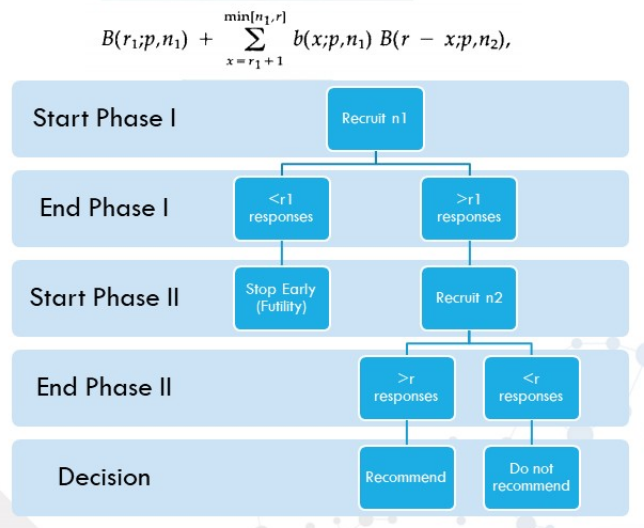

# Clinic Trail


## Introduction

### Regulation

* ICH Guideline for Good Clinical Practice E6 – current version
* ICH E9 Statistical principles for clinical trials
* Declaration of Helsinki – Ethical Principles for Medical research Involving Human Subjects – current version
* ISO 14155 – Clinical investigation of medical devices for human subjects – Good Clinical Practice – current version
* ISO 20916 - In vitro diagnostic medical devices — Clinical performance studies using specimens from human subjects — Good study practice – current version
* EMA (European Medicines Agency) Missing data in confirmatory clinical trials 
* EMA (European Medicines Agency) Investigation of bioequivalence

### Protocol Deviations

The following protocol deviations should be considered in defining analysis sets:

- Violation of the inclusion criteria and/or exclusion criteria
- Incorrect dosage or false therapy (therapy change)
- Erroneous randomization or treatment allocation
- Insufficient treatment compliance
- Failure to comply with scheduled visits
- Missing data
- Premature therapy stop (dropout)
- Concomitant diseases or therapies excluded in the trial protocol

It is important to note that premature termination of study participation is not in violation of the study protocol and should therefore not be considered when defining analysis sets. Due to special aspects of particular studies, additional demands might be required to specify evaluable study subjects. These demands need to be formulated in the study protocol (for example replacement of very early excluded subjects, target criteria evaluation in case of early withdrawal) or SAP, or they may be defined in a data review meeting. Furthermore, it needs to be clearly differentiated between protocol deviation classification (major/minor) during the trial, which are primarily generated by the monitoring and data management team, and the final classification that is used for the allocation to analysis sets. The final classification has to be used for the allocation of subjects to analysis sets, if absence of major (or critical) protocol deviations are a determining factor.

> 重要的是要注意，提前终止研究参与并不违反研究方案，因此在定义分析集时不应考虑。 由于特定研究的特殊方面，可能需要其他要求来指定可评估的研究主题。 这些需求需要在研究方案中提出（例如，替换非常早排除的受试者，在提前退出的情况下评估目标标准）或SAP，或者可以在数据审查会议中进行定义。 此外，需要明确区分试验期间的协议偏差分类（主要/次要）（主要由监视和数据管理团队生成）和用于分配给分析集的最终分类。 如果没有主要（或关键）方案偏差是决定因素，则最终分类必须用于将受试者分配给分析集。


### Analysis Sets

#### Full-Analysis-Set (FAS)

The Full-Analysis-Set should include all randomized trial participants. They will be
analyzed as randomized according to the Intention-To-Treat (ITT) principle. Basically, this
implies evaluating all trial subjects within their allocated treatment group, regardless of
whether they changed the treatment group, refused or discontinued the therapy, or other
violations of the protocol occurred. The accurate definition of the Full-Analysis-Set is 
described in the study protocol or in the statistical analysis plan in compliance with ICH
guideline E9. Imputation techniques may be required to substitute missing values of
important variables. The applied imputation methods should be defined in the study
protocol or statistical analysis plan.

It is possible to define the FAS by means of a modified ITT (mITT) principle. The mITT
population is a subset of the FAS population and allows exclusion of randomized subjects
in a justified way (e.g. patients deemed ineligible after randomization and patients who
never started treatment or received less than a specified minimum amount of the intended
intervention).

#### Per-Protocol-Set (PPS)

The Per-Protocol-Set is defined as the group of trial subjects, in which no (major/critical)
protocol deviations occurred, which were treated according to the protocol and all
examinations required to evaluate the study’s objectives were completed. The definition of
the PPS therefore is highly dependent on the conditions of a specific trial. The PPS is a
subset of the FAS. Subjects who have been treated and reported to a certain degree of
compliance with the protocol in all essential aspects of the trial may be analyzed in the
PPS. This should be discussed and described in the statistical analysis plan. The detailed
reasons for excluding subjects from the PPS should be fully defined. In blinded studies
this should happen prior to unblinding.

#### Safety-Evaluation-Set (SES)

The Safety-Evaluation-Set generally consists of all enrolled subjects who received study
treatment at least once. The Safety-Evaluation-Set should be defined in the study protocol
or in the statistical analysis plan and should be used as the primary analysis set for all
safety evaluations.


### Randomization

#### Simple randomization

Randomization based on a single sequence of random assignments is known as simple randomization.

> 对于两个治疗组（对照组与治疗组），硬币的侧面（即正面-对照组，反面-治疗）确定每个受试者的分配。其他方法包括使用经过洗牌的纸牌（例如，偶数控制，奇数处理）或掷骰子（例如，低于并等于3控制，超过3处理）这种随机方法简单易行，可在临床研究中实施。在大型临床研究中，可以相信简单随机会在组之间生成相似数量的主题。但是，在相对较小的样本量临床研究中，随机化结果可能会出现问题，从而导致组中参与者的数量不相等。

```{r Simple-Randomization,echo = T,message = FALSE, error = FALSE, warning = FALSE}
set.seed(888)
treatment <- c("A","B")
simple.list <- sample(treatment, 20, replace=TRUE)
cat(simple.list,sep="\n")
table(simple.list)
```

#### Block randomization

The block randomization method is designed to randomize subjects into groups that result in equal sample sizes. This method is used to ensure a balance in sample size across groups over time. Blocks are small and balanced with predetermined group assignments, which keeps the numbers of subjects in each group similar at all times. The block size is determined by the researcher and should be a multiple of the number of groups (i.e., with two treatment groups, block size of either 4, 6, or 8). Blocks are best used in smaller increments as researchers can more easily control balance.

> 块随机化方法旨在将受试者随机分组，从而产生相同的样本量。使用此方法可确保随着时间的推移，各个组之间的样本量保持平衡。区块很小，并且通过预定的小组分配来平衡，这使每个小组中的被试人数始终保持相似。区块大小由研究人员确定，并且应为组数的倍数（即，对于两个治疗组，区块大小为4、6或8）。最好以较小的增量使用块，因为研究人员可以更轻松地控制平衡。

After block size has been determined, all possible balanced combinations of assignment within the block (i.e., equal number for all groups within the block) must be calculated. Blocks are then randomly chosen to determine the patients’ assignment into the groups.

> 确定块大小后，必须计算该块内分配的所有可能平衡组合（即，该块内所有组的数量均相等）。然后随机选择块来确定患者的分组。

**Example 以区组长度4为例**

* 一个区组内的4个研究对象可以有6种排列方式：1. AABB, 2. ABAB, 3. ABBA, 4. BAAB, 5. BABA, 6. BBAA 
* 确定好所有的排列形式后，接下来需要将6个区组随机排列。我们可以用各种方式（如SPSS、Excel、SAS等）产生一串随机数字. 因为只有6种排列方式，因此可以只选择1-6之间的数字，25126423121362555343526422
* 按照上述随机数字排列区组

**BLOCKED RANDOMIZATION USING THE PROC PLAN**

```
* randomization within block;
%macro ran_block (blockNum);
…
%if &seed= %then %do;
 proc plan;
 factors N=&blocksize / noprint;
 output data=One out=Two
 run;
%end;
%else %do;
 Proc plan seed=%eval (&seed+blockNum);
 Factors N=&blockSize / noprint;
 Output data=One out=Two;
 Run;
%end;
…
%mend ran_block;
```

**BLOCKED RANDOMIZATION USING psych Package**

```{r psych,echo = T,message = FALSE, error = FALSE, warning = FALSE}
library("psych")
my.cond <- block.random (n=96,c( drug=2,time=3,imp=2)) 
headtail(my.cond) 
## Visualizing block randomization
pairs.panels (my.cond)
```


**BLOCKED RANDOMIZATION USING blockrand Package**

```{r blockrand,echo = T,message = FALSE, error = FALSE, warning = FALSE}
### Generate a block randomization for a clinical trial;
library("blockrand")
set.seed(888)
block.list <- blockrand(n=20, num.levels = 2,block.sizes = c(2,2))
block.list
block.list2 <- blockrand(n=20, num.levels = 2,block.sizes = c(1,2))
block.list2
plot(block.list2)
```


#### Stratified randomization

The stratified randomization method addresses the need to control and balance the influence of covariates. This method can be used to achieve balance among groups in terms of subjects’ baseline characteristics (covariates). Specific covariates must be identified by the researcher who understands the potential influence each covariate has on the dependent variable. Stratified randomization is achieved by generating a separate block for each combination of covariates, and subjects are assigned to the appropriate block of covariates. After all subjects have been identified and assigned into blocks, simple randomization is performed within each block to assign subjects to one of the groups.

> 分层随机方法解决了控制和平衡协变量影响的需求。此方法可用于在受试者的基线特征（协变量）方面实现组间的平衡。研究人员必须确定特定的协变量，他们必须了解每个协变量对因变量的潜在影响。分层随机化是通过为协变量的每种组合生成一个单独的块来实现的，并将主题分配给合适的协变量块。在确定了所有主题并将其分配到块中之后，在每个块内执行简单的随机化以将主题分配给其中一个组。

$$
\begin{array}{|l|c|c|}
\hline \text { Stratum } & \text { Age Group } & \text { Severity Score } \\
\hline 1 & \geq 50 \text { years } & \geq 7 \\
\hline 2 & <50 \text { years } & \geq 7 \\
\hline 3 & \geq 50 \text { years } & <7 \\
\hline 4 & <50 \text { years } & <7 \\
\hline
\end{array}
$$


```{r Stratified,echo = T,message = FALSE, error = FALSE, warning = FALSE}
over50.severe.list <- blockrand(n=100, num.levels = 2,
                                block.sizes = c(1,2,3,4), 
                                stratum='Over 50, Severe',id.prefix='O50_S', block.prefix='O50_S')
headtail(over50.severe.list)
```


## Phase I Trials Design

### Introduction

The primary aims of Phase 1 Clinical Trials are to determine the **safety, tolerability and pharmacokinetics (PK)** of a compound. Trials have historically been conducted in the logical sequence of single ascending dose, multiple ascending dose, examination of preliminary effect of food on exposure, and potential drug-drug interaction, with assessments to determine the effect of gender, age, bioavailability and bioequivalence performed as necessary. Additional studies may be performed, including definitive electrocardiogram (ECG) investigations to thoroughly evaluate the QT/QTc prolongation potential of a compound, which can increase the risk of potentially fatal proarrhythmias. 

> 1期临床试验的主要目的是确定化合物的安全性，耐受性和药代动力学（PK)。 历史上，按单次递增剂量，多次递增剂量，检查食物对暴露的初步效果以及潜在的药物相互作用的逻辑顺序进行试验，并进行评估以确定性别，年龄，生物利用率和生物等效性的影响 必要的。 可能还会进行其他研究，包括确定性心电图（ECG）检查，以彻底评估化合物的QT / QTc延长潜力，这可能会增加致命性心律失常的风险。 


#### Single ascending dose

Single ascending dose
These are studies in which a small group of subjects receive a single dose of the compound in a clinical setting, usually a Clinical Research Unit (CRU). Close safety monitoring and usually PK assessments are performed for a predetermined time. If the compound is deemed to be well tolerated, and the PK data are broadly as expected, dose escalation occurs, either within the same group or a further group of healthy subjects, according to the approved protocol. Dose escalation usually continues until the maximum dose has been attained per the protocol unless predefined maximum exposure is reached or intolerable side effects become apparent. Additionally, dose escalation may be discontinued (or may proceed more cautiously than planned) if there is evidence of a supra-proportional relationship between dose and exposure, such that exposures at higher dose levels become difficult to predict. 

> 一小部分受试者在临床环境（通常是临床研究单位（CRU））中接受单剂量的化合物。在预定的时间内进行密切的安全监控和通常的PK评估。如果认为该化合物具有良好的耐受性，并且PK数据大致符合预期，则根据批准的方案，在同一组或另一组健康受试者中会发生剂量增加。除非根据预定义的最大暴露量或出现无法忍受的副作用，否则剂量递增通常会一直持续到按照方案达到最大剂量。另外，如果有证据表明剂量与暴露量之间存在超比例关系，则可以停止剂量递增（或者可能比计划更谨慎地进行），从而难以预测更高剂量水平的暴露量。

Studies usually include sequential groups in a parallel design for maximum exposure or are of a crossover design to provide more information on dose linearity. To minimize the effect of bias, subjects are usually randomly assigned to treatment using computer generated randomization codes produced by Statisticians. Studies are usually placebo controlled to determine whether effects observed are due to the study drug or environmental conditions, and are often conducted in a single (subject) blinded manner to allow informed decision on dose escalation, with safety and PK data being available for investigator review.

> 研究通常包括平行设计中的顺序组，以最大程度地暴露；或者交叉设计，以提供有关剂量线性的更多信息。为了使偏差的影响最小化，通常使用统计学家产生的计算机生成的随机编码将受试者随机分配到治疗中。研究通常由安慰剂控制，以确定观察到的效果是否是由于研究药物或环境条件引起的，并且通常以单（受试者）盲法进行，以允许就剂量递增做出明智的决定，并提供安全性和PK数据供研究者审查。


#### Multiple ascending dose

These studies are conducted to elucidate the pharmacokinetics (PK) and pharmacodynamics (PD) of multiple doses of the compound, again usually in a CRU (Clinical Research Unit). The dose levels and dosing intervals (ie, time between consecutive doses) are selected as those that are predicted to be safe from single dose data. Samples are collected and analyzed to allow the determination of PK profiles and a better understanding of how the drug is processed by the body; with multiple dosing, a key part of the PK analysis is to identify if accumulation of the drug occurs. As for single ascending dose studies, dose escalation proceeds according to the protocol assuming strict safety and PK criteria are met. Dose levels and dosing frequency are chosen to achieve therapeutic drug levels within the systemic circulation that are maintained at steady state for several days to allow appropriate safety parameters to be monitored. It is usual for 2 3 dose levels to be studied, at and above the expected therapeutic dose level(s) to determine the ‘safety margin’ for repeat dose administration.

> 进行这些研究以阐明多剂量化合物的药代动力学（PK）和药效学（PD），通常也要在CRU（临床研究单位）中进行。选择剂量水平和给药间隔（即连续剂量之间的时间）作为从单剂量数据预测是安全的剂量水平和剂量间隔。收集样本并进行分析，以便确定PK曲线并更好地了解药物如何被人体处理；通过多次给药，PK分析的关键部分是确定是否发生了药物蓄积。对于单次递增剂量研究，假定符合严格的安全性和PK标准，则按照方案进行剂量递增。选择剂量水平和给药频率以达到全身循环内维持稳定状态数天的治疗药物水平，以监测合适的安全性参数。通常，在预期治疗剂量水平或更高剂量下研究2 3个剂量水平，以确定重复剂量给药的“安全裕度”。


### NIC-002 (Charité)

A 3-part study to investigate the safety and pharmacokinetics of a novel niclosamide solution as a treatment option for COVID-19 in combination with camostat


#### Study Design

**Compounds:**

* Niclosamide, Bayer AG, oral solution, 40 mg/mL
    + Active incredient: Niclosamide
* Niclosamide (Yomesan® Bayer Vital GmbH) 500 mg chewing tablets
    + Active ingredient: Niclosamide


This 3-part study is designed to investigate 

* (1) safety and pharmacokinetics of single ascending doses of the new niclosamide solution after fasted and fed conditions, 
* (2) the relative bioavailability of the niclosamide solution compared to the chewing tablet, and 
* (3) safety and pharmacokinetics of the new niclosamide solution after multiple doses in healthy volunteers.


> 这项分为三部分的研究旨在研究（1）在禁食和进食后单次递增剂量新烟酰胺溶液的安全性和药代动力学；（2）与咀嚼片相比，烟酰胺溶液的相对生物利用度；以及（3）在健康志愿者中多次给药后新烟酰胺溶液的安全性和药代动力学。

The maximum number of subjects is 28

#### Primary Objective

* To assess the safety and tolerability of single ascending doses of the niclosamide solution in healthy volunteers (Part A)
* To assess PK parameters of single ascending doses of the niclosamide solution in healthy volunteers (Part A)

The primary endpoints of the study are safety and PK.

Safety will be evaluated according to the following parameters:

* Adverse event monitoring - AEs and SAEs 
* Physical examination 
* Vital signs (blood pressure, pulse rate, temperature, respiratory rate) 
* Safety lab 
* ECG

The following PK parameters will be determined:
$\mathrm{C}_{\max }, \mathrm{C}_{8 \mathrm{~h}}, \mathrm{C}_{12 \mathrm{~h}}, \mathrm{C}_{24 \mathrm{~h}}, \mathrm{~T}_{\max }, \mathrm{AUC}_{\text {last }}, \mathrm{AUC}_{\mathrm{inf}}, \mathrm{T}_{1 / 2}, \mathrm{CL} / \mathrm{F}$


#### Statistical Analysis

All medical terms reported as adverse events (AE) are coded according to the Medical Dictionary for Regulatory Activities (MedDRA) for safety analysis. At least the primary System Organ Class (SOC) as well as the Preferred Term (PT) will be available for the statistical analysis. Incidences of AEs will be summarized by intensity and relationship to the study drug. For each treatment, descriptive statistics will be calculated for plasma concentration of niclosamide at each applicable time point specified, and for the derived plasma PK parameters. 

> 所有报告为不良事件（AE）的医学术语均根据《管制活动医学词典》（MedDRA）进行编码，以进行安全性分析。至少主要的系统器官分类（SOC）以及首选术语（PT）将可用于统计分析。 AE的发生率将通过强度和与研究药物的关系进行汇总。对于每种治疗，将在指定的每个适用时间点针对烟酰胺的血浆浓度以及派生的血浆PK参数计算描述性统计数据。


## Phase II Trials Design
 
### Introduction

* Phase IIa: Proof-of-Concept (50/100)  强调快速评估，早期无效评估
    + Emphasise quick evaluation, early futility assessment 
    + Find proof of positive response for proposed treatment to recommend for further clinical trial evaluation 
    + Example Methods: One sample, Fleming Test, Simon’s Design
* Phase IIb: Dose-Finding (100/1000) 未知的剂量反应曲线，获得正确的模型/剂量
    + Unknown dose-response curve, get right model/doses 
    + Find dose-response curve to see dose-response relationship, evaluate if strong enough response & if so select Phase III doses 
    + Examples Methods: Contrast tests, Cochran-Armitage, MCP-Mod
   

### Terra

#### Study Design

The medical application is based on small incision lenticule extraction for the correction of refractive errors. To not only correct the refractive error but also to alter the spherical aberration, e.g. for the compensation of presbyopia, the subject method is inducing a change of the effective refractive power over pupil size. 

Therefore, the aim of this clinical investigation is to **combine a non-linear corneal aspheric ablation profile with micro-anisometropia**. Inducing such a change in the refractive properties of the cornea leads to an increased depth of field, if the postoperative spherical aberrations are kept within the therapeutic range.

> 医学上的应用是基于小切口小孔镜摘除术，以矫正屈光不正。不仅要校正屈光不正，而且要改变球面像差，例如为了补偿老花眼，本发明的方法是引起有效屈光力随瞳孔大小的变化。
因此，该临床研究的目的是将非线性角膜非球面消融轮廓与微屈光参差症相结合。如果术后球面像差保持在治疗范围内，则诱导角膜屈光特性的这种变化会导致景深增加。

The treatment method is intended for refractive corrections by creating and then surgically removing intrastromal lenticules.

> 通过外科手术去除基质内微透镜来进行屈光矫正。

#### Primary Objective

The main objective is to investigate the **safety and efficacy** of small incision lenticule extraction combined with a non-linear corneal aspheric profile and  micro-anisometropia. The modification of the spherical aberration is intended to extend the depth of field in each eye and therefore enable improved binocular vision at all distances. 

**Primary endpoints**

* Endpoints on SAFETY: The loss of more than 2 lines of CDVA at months postoperative compared to the baseline visit for an eye. 
* Endpoints on EFFECTIVENESS: Patients with binocular UDVA of 20/20 or better and at the same time a UNVA of 20/32 (J3) or better at 3 months postoperatively. 


#### Statistical Analysis


<!-- --------------------------------------------------------- -->

### LOTAB

A Prospective, Multicenter, Double-Blind, Placebo-Controlled, Dose-Finding Phase-II Study for the Efficacy and Safety of LAIS® House Dust Mites Sublingual Tablets in Patients with Mite-Induced Allergic RhinoConjunctivitis Without or With Controlled Asthma using a Titrated Nasal Provocation Test model

> 一项前瞻性，多中心，双盲，安慰剂对照，剂量发现II期研究，使用滴定鼻饲法治疗患有或不经控制螨虫诱发的过敏性鼻结膜炎的LAIS®家尘螨舌下含片的疗效和安全性 挑衅测试模型

#### Study Design

* subjects with mites-induced Allergic Rhinoconjunctivitis (ARC) without or with controlled asthma
* double-blind, randomized, placebo-controlled, four-arm
    + Treatment group 1: 0 UA once daily (placebo)
    + Treatment group 2: 1,000 UA once daily (verum)
    + Treatment group 3: 10,000 UA once daily (verum)
    + Treatment group 4: 30,000 UA once daily (verum)


This is a multi-center, prospective, double-blind, randomized, placebo-controlled, four-arm, parallel-group, dose-finding phase-II study in subjects with mites-induced Allergic Rhinoconjunctivitis (ARC) without or with controlled asthma using a titrated nasal provocation test model. There will be three verum and one placebo group with once daily (o.d.) dosing over 48 to 56 weeks. Overall, 11 Visits (V0 to V10) and 3 Phone Calls (PC1 to PC3) are planned in this study.

> 多中心，前瞻性，双盲，随机，安慰剂对照，四组，平行组，剂量确定型II期研究，用于患有或不患有哮喘的螨虫诱发的变应性鼻结膜炎（ARC）患者 使用滴鼻刺激试验模型。 将有3个verum和一个安慰剂组，每天一次（od.d.）在48至56周内服药。 总体而言，本研究计划进行11次访问（V0至V10）和3个电话呼叫（PC1至PC3）。


**Blinding**

Since this is a double-blind study, investigators, site staff and subjects will be blind to the treatment allocation. That means neither the subjects nor the investigators and site staff know whether a subject is in one of the verum groups or in the placebo group. This shall prevent biased results that may arise from the knowledge of the treatment code. Breaking of this code is only valid under certain circumstances as described in the corresponding section of the study protocol.

> 由于这是一项双盲研究，研究人员，现场工作人员和受试者将对治疗分配不知情。 这意味着受试者，研究人员和现场工作人员都不知道受试者是属于verum组之一还是安慰剂组。 
这将防止因处理规范的知识而产生的有偏见的结果。 仅在某些情况下（如研究方案的相应部分所述），才能破解此密码。


#### Primary Objective

The objective of this study is to find the **optimal effective and safe dose of LAIS® mites sublingual tablets** for sublingual immunotherapy (SLIT). All efficacy and safety assessments will be taken into account for the decision. Thus, there is no statistical criterion for selection of the optimal dose.

**Efficacy**: To evaluate the efficacy of different doses of LAIS® mites sublingual tablets once daily for sublingual immunotherapy after 48 to 56 weeks of treatment based on Lebel’s Symptoms Score following a titrated nasal provocation test (TNPT).


> 这项研究的目的是找到用于舌下免疫疗法（SLIT）的最佳有效和安全剂量的LAIS®螨舌下片剂。 所有的功效和安全性评估都将被考虑在内。 因此，没有用于选择最佳剂量的统计标准。

> 根据滴定的鼻腔激发试验（TNPT），根据Lebel的症状评分，评估治疗48至56周后每天一次不同剂量的LAIS®螨舌下片剂对舌下免疫疗法的疗效。

**Primary Variable**

Change over time (final TNPT vs. baseline TNPT) in the mean Lebel’s Symptoms Score in response to mite provocation for the three verum groups compared to placebo

> 与安慰剂相比，这三个Verum组对螨虫激发的反应随时间变化（最终TNPT与基线TNPT）的平均Lebel症状评分

**Null hypotheses**	  

Each null hypothesis H0k postulates that there is no difference between verum group and placebo. Consequently, the alternative hypothesis H1k postulates that there is a difference between verum group and placebo. These hypotheses will in the following be defined as: 


$$H_{01}: 30,000 AU = 0 AU;   H_{02}: 10,000 AU = 0 AU;   H_{03}: 1,000 AU = 0 AU $$


#### Secondary Objectives

Safety: 根据不同的安全性评估，评估48至56周治疗后每天一次不同剂量的LAIS®螨舌下片剂的安全性，以进行舌下免疫治疗。

**Safety endpoints**

* Number of events and number of subjects affected by TEAEs and SAEs, local and systemic reactions as well as analyses of early (occurring within 30 min after IMP intake) or delayed reactions (occurring later than 30 min after IMP intake)
* Further safety data obtained by physical examination (per body system), vital signs (body temperature, heart rate, systolic and diastolic blood pressure), laboratory variables (several parameters for hematology, biochemistry, urinalysis), spirometry (FEV1, FEV1/FVC, PEF and optional MEF 25, 50, 75% and/or MEF 25-75)

> 受TEAE和SAE影响的事件数和受试者数，局部和全身反应，以及早期（在IMP摄入后30分钟内发生）或延迟反应（在IMP摄入后30分钟后发生）的分析
> 通过身体检查（每个身体系统），生命体征（体温，心率，收缩压和舒张压），实验室变量（血液学，生化，尿液分析的多个参数），肺活量测定法（FEV1，FEV1 / FVC）获得的更多安全性数据 ，PEF和可选的MEF 25、50、75％和/或MEF 25-75）


#### Hierarchical Test 

The analysis of the primary endpoint will include three confirmatory statistical tests in the best case since each verum group (30,000 AU; 10,000 AU; 1,000 AU) is compared to placebo (0 AU). In order to account for the multiple confirmatory tests, the hypotheses H11 to H13 defined in Section 2.5 will be hierarchically ordered and they will be tested individually in the order H11 (30,000 AU ≠ 0 AU) to H13 (1,000 AU ≠ 0 AU), each on the same significance level α = α1 = α2 = α3 = 5%; as long as the former null hypothesis H0k is rejected. If a null hypothesis H0k is not rejected, all subsequent hypotheses will be tested exploratory and no confirmatory claims can be based on the results. The described hierarchical test procedure is considered to be suitable as it is expected that the difference to the placebo group between the verum groups increases with dose. Due to this hierarchical testing approach, no multiple comparison correction must be applied to the significance level . 

Only the analysis of the primary endpoint will be of confirmative character, all other tests and confidence intervals (CIs) will be of exploratory character only. No confirmatory conclusions will be drawn from the exploratory analyses. 

> 在最佳情况下，主要终点的分析将包括三个验证性统计检验，因为将每个verum组（30,000 AU； 10,000 AU； 1,000 AU）与安慰剂（0 AU）进行了比较。为了说明多重验证性检验，将对第2.5节中定义的假设H11至H13进行分层排序，并分别以H11（30,000 AU≠0 AU）至H13（1,000 AU≠0 AU）的顺序进行测试，每个具有相同的显着性水平α=α1=α2=α3= 5％；只要以前的零假设H0k被拒绝即可。如果没有否定假设H0k，则所有后续假设都将进行探索性测试，并且基于结果的确认性主张也将不成立。所描述的分级测试程序被认为是合适的，因为期望Verum组之间与安慰剂组的差异随剂量而增加。由于采用了这种分层测试方法，因此不必对显着性水平应用多重比较校正。
仅主要终点的分析将具有确定性，所有其他检验和置信区间（CI）仅具有探索性。从探索性分析中不会得出证实性结论。

#### Statistical Analysis

The analysis of covariance (ANCOVA) model described in the protocol is extended to a linear mixed model ANCOVA accounting for repeated measurements by addition of the fixed effects ‘Visit’ and the corresponding treatment group-visit interaction.

* ‘treatment arm’, ‘visit’ as well as the interaction between treatment duration and treatment arm are used as **fixed effects**.
* The mean LSS at baseline is used as **covariate**.
*  ‘subject’ as **random effect**.

An unstructured covariance matrix is assumed. Denominator degrees of freedom for the tests of fixed effects will be determined based on the Kenward-Roger approximation. In case of no missing data, the results obtained by both models should only differ to a negligible amount. In case of missing data, however, the mixed model usually reduces the loss of power since subjects whose observations are limited to the interim TNPT because of early study termination will be taken into account when estimates are made of treatment effects at the final TNPT. Therefore, the mixed model will include mean LSS at interim and final TNPT as dependent variable as well as treatment group, visit and treatment group-visit interaction as fixed factor and baseline mean LSS as covariate. 

> 使用非结构化协方差矩阵。用于固定效果测试的分母自由度将根据Kenward-Roger近似确定。如果没有缺失数据，则两个模型所获得的结果之间的差异应可忽略不计。但是，在缺少数据的情况下，混合模型通常会减少功率损失，因为当对最终TNPT的治疗效果进行估算时，由于早期研究终止而其观察仅限于临时TNPT的受试者。因此，混合模型将包括中期和最终TNPT的平均LSS作为因变量以及治疗组，就诊和治疗组的访视互动作为固定因子，而基线平均LSS作为协变量。

The following SAS code can be used to obtain adjusted least square means for the post-treatment mean LSS and corresponding 95% confidence intervals as well as to obtain p-values for the comparison of the change over time and corresponding 95% confidence intervals: 

```
proc mixed data=<dataset name>;
  class <subject id> <treatment group> <visit>;
  model <mean LSS at visit> = <treatment group> <visit> 
  <treatment group>*<visit> 
  <mean LSS at baseline> / solution DDFM=KR;
  repeated <visit> / subject=<subject id> type=UN;
  lsmeans <treatment group>*<visit> / cl diff e;
run;
quit;
```

> 如果在任何治疗组中可评估主要终点数据的受试者人数低于46，则将根据第5.1节中所述的程序估算缺失数据，并使用方案中所述的ANCOVA模型。 在这种情况下，可以使用以下SAS代码：

```
proc glm data=<dataset name>;
   	class <treatment group>;
      model <mean LSS at Visit 10> = <treatment group> <mean LSS at baseline>	
/ solution ;
      lsmeans <treatment group> / stderr pdiff cov cl out=adjmeans;
   run;
   quit;
```

As further safety analysis, incidence rates of IMP-related TEAEs per patient year will be calculated. For this purpose, the number of IMP-related TEAEs will be divided by the number of patient years observed in the study. The number of patient years is the sum of the individual observation periods, where the observation period for a patient is the time between start of treatment and (premature) study discontinuation or end of treatment, whichever is earlier. The incidence rate will be reported together with exact two-sided 95% CIs. For calculation of the 95% CIs, it is assumed that the number of AEs observed in the study is Poisson distributed. If any IMP-related serious TEAE or unacceptable AE occurs, the analysis will be repeated for these kinds of AEs. The required 95% CIs can be obtained by a variation of the following SAS-code:

> 作为进一步的安全性分析，将计算每个患者每年与IMP相关的TEAE的发生率。 为此，将与IMP相关的TEAE数除以研究中观察到的患者年数。 患者的年数是各个观察期的总和，其中患者的观察期是指从治疗开始到研究研究（过早）终止或治疗结束之间的时间，以较早者为准。 将报告发病率以及确切的两侧95％CI。 为了计算95％CI，假设研究中观察到的AE数是Poisson分布的。 如果发生任何与IMP相关的严重TEAE或不可接受的AE，则将针对这些类型的AE重复分析。 可以通过以下SAS代码的变体获得所需的95％CI


```
proc genmod data=<dataset name>;
    class <AE term>;
    model <number of events per patient year> = <AE term>
    / dist=poisson link=log offset=<log(1 patient year)>;
    store out=insmodel;
run;

proc plm source=insmodel;
    score data=<dataset name> out=inspred pred stderr lclm uclm 
		   / nooffset ilink;
run;
```


<!-- --------------------------------------------------------- -->


### NICCAM

A randomized, single blind, placebo controlled, parallel-arm study to investigate the safety and preliminary efficacy of Niclosamide and Camostat alone and in combination to treat Covid-19 (“NICCAM”)

> 单独使用尼氯酰胺和卡莫司他并联合治疗Covid-19（“ NICCAM”）的安全性和初步疗效

#### Study Design

**Investigational Medicinal Products**

* Camostat (Foipan™ Ono Pharmaceutical OR Nichi-Iko Pharmaceutical) 100 mg capsules or tablets, active ingredient: Camostat mesilate 
* Niclosamide (Yomesan® Bayer Vital GmbH) 500 mg chewing tablets, active ingredient: Niclosamide

This is a randomized, single-blind, placebo-controlled, parallel-arm single center trial in three cohorts.

* Cohort 1, 3 arms: 
   + A. Camostat n=8, 300 mg TID
   + B. Niclosamide n=8, 2 g QD
   + C. Placebo n=8
* Cohort 2, 3 arms:
   + D. Camostat n=16, 600 mg TID OR Camostat n=8, 300 mg TID if sufficiently efficacious in cohort 1
   + E. Niclosamide n=8, 2 g QD
   + F. Placebo n=8
* Cohort 3, 2 arms
   + G. Best treatment option n=20
       + Best treatment option is selected according to following priorities:
       + First choice: Combination Niclosamide 2g QD + Camostat 600 TID if both treatments have proven safe in cohorts 1+2
       + OR (second choice): Combination niclosamide 2 g QD + Camostat 300 TID
       + OR (third choice): Niclosamide alone if Camostat dosing has not proven to be safe during cohorts 1+2 OR Camostat alone if Niclosamide has not proven to be safe during cohorts 1+2. Patient number for this third choice is n=20 minus the number of patients already enrolled for the respective treatment from cohorts 1 and 2. 
   + H. Placebo n=4


**Sample size (Justifications )**

No formal sample size calculation has been performed. N=20 for treatment and placebo seems large enough to have an initial safety and efficacy assessment. Next to a budgetary constraint to sample size, there is also an ethical constraint to not treat with inefficacious medicines. 


#### Primary Objective

**Primary Objective**

To assess the safety and tolerability of ascending doses of Camostat and of the treatment combination Niclosamide and Camostat in mild to moderately affected Covid-19 patients.

**Exploratory objectives**

To assess the preliminary efficacy (“proof of concept”) of Camostat in two ascending doses and of Niclosamide at 2 g QD, each substance alone and both substances in combination in mild to moderately affected Covid-19 patients over a 7 day treatment period.


#### Statistical Analysis

The primary endpoint of the study is safety. Safety will be evaluated according to the following parameters:

* Adverse event monitoring - AEs and SAEs
* Physical examination
* Vital sign monitoring (blood pressure, pulse rate, temperature, respiratory rate, oxygen saturation)
* Safety lab including coagulation

All medical terms reported as adverse events (AE) are coded according to the Medical Dictionary for Regulatory Activities (MedDRA) for safety analysis. At least the primary System Organ class (SOC) as well as the Preferred Term (PT) will be available for the statistical analysis. Incidences of AEs will be summarized by intensity and relationship to the study drug. 

Baseline characteristics as well as efficacy outcomes will be evaluated descriptively, by appropriate summary measures of the empirical distribution as well as 95% confidence intervals and descriptive two-sided p-values comparing the treatment groups. 


## Phase III Trials Design

### Introduction

Phase III clinical trials are the **gold standard** to demonstrate the effects of an experimental therapy compared to standard therapy for a disease of interest. The first step when planning a phase III trial is to specify the statistical hypothesis that the trial purports to test, which is usually that the experimental therapy provides some efficacy benefit over standard therapy, without adding significant harm. In a phase III trial, a pre-specified number of patients from the target population are randomized to receive experimental or standard therapy. The patients are treated and followed up according to a protocol that also defines the endpoints of interest, in particular the primary endpoint which is chosen to reflect a clinical benefit of experimental therapy over standard therapy. The trial data are typically monitored by an independent committee who may recommend stopping the trial early, if appropriate. The benefit of experimental therapy over standard therapy, if any, may be observed across all patients, or may be confined to a subset of patients.

> III期临床试验是金标准，可证明与标准疗法相比，对于目标疾病而言，实验疗法的效果。计划进行III期临床试验的第一步是明确说明该试验所要测试的统计假设，通常是实验性疗法比标准疗法具有一定的疗效，而又不会增加明显的危害。在III期试验中，将来自目标人群的预先指定数量的患者随机分配接受实验或标准治疗。根据还定义了目标终点的方案对患者进行治疗和随访，特别是选择主要终点以反映实验治疗相对于标准治疗的临床益处。审判数据通常由独立委员会进行监控，如果合适的话，委员会可能建议尽早停止审判。实验疗法相对于标准疗法的益处（如果有的话）可以在所有患者中观察到，或仅限于一部分患者。


### MG-III-001

#### Study Design

This study is a retrospective, blinded analysis of archival tissue and corresponding clinical data using the **MelaGenix® GEP**. The archival tissue and corresponding clinical data will be collected from up to 10 study sites. Primary tumor tissue in FFPE blocks from up to 700 patients with histologically confirmed AJCC substages IIIA, IIIB or IIIC resectable cutaneous **melanoma** will be analyzed.

The aim of this study is to validate the performance of MelaGenix® as an independent prognostic factor for estimating 5-year melanoma-specific survival (MSS), and to demonstrate that the survival rate of patients classified as "MelaGenix® low risk" is significantly higher than that of patients classified as "MelaGenix® high risk", for AJCC substages: IIIA, IIIB and IIIC respectively.


> 这项研究是使用MelaGenix®GEP对档案组织和相应临床数据进行的回顾性，盲法分析。 档案组织和相应的临床数据将从多达10个研究地点收集。 将分析多达700例经组织学证实为AJCC IIIA，IIIB或IIIC可切除皮肤黑色素瘤的患者的FFPE块中的原发性肿瘤组织。这项研究的目的是验证MelaGenix®作为评估5年黑色素瘤特异性存活（MSS）的独立预后因素的性能，并证明**归类为“MelaGenix®低危”的患者的存活率显着 高于“MelaGenix®高风险”分类的AJCC子级患者：IIIA，IIIB和IIIC**

#### Primary Objective

The primary objective of this retrospective study is to confirm that 
**MSS is significantly higher in patients classified as “MelaGenix® Low Risk” than in patients classified as “MelaGenix® High Risk” for AJCC substages: IIIA, IIIB and IIIC.**The primary endpoint is the melanoma-specific survival (MSS) and is defined as the time (in months) from the date of initial diagnosis until melanoma-specific death.

**Secondary Endpoints**

* Relapse-free survival (RFS) is defined as the time (in months) from the date of initial diagnosis until the first local, regional/nodal, or distant relapse; 
* Distant metastasis-free survival (DMFS) is defined as the time (in months) from the date of initial diagnosis until the first distant metastasis.


#### Statistical Analysis


**Primary Endpoint**

The Log-Rank test stratified by study site will be used to assess each hypothesis described in Section 2.5 to evaluate differences of MSS between “MelaGenix® Low Risk” and “MelaGenix® High Risk” in AJCC substages. The family-wise error-rate will be maintained using the **Bonferroni-Holm procedure** to perform the tests in the substages IIIA, IIIB and IIIC. The one-sided significance levels at interim and final are calculated to $\alpha$ interim = 0.0222 and $\alpha$ final = 0.0120, respectively. The following sequence of primary tests shows the Bonferroni-Holm procedure of the interim analysis using $\alpha$ interim = 0.0222. The final analysis is based on a completely similar procedure using $\alpha$ final = 0.0120.

* For interim analysis, the stratified Log-Rank test will be first carried out at the level of $\alpha$ interim/3 = 0.0074 for each substage, then the 3 p-values will be sorted into order lowest-to-highest P1, P2, P3 with their corresponding null hypotheses H1, H2, H3. 
* If P1 < 0.0074 ($\alpha$ interim/3), then H1 will be rejected and continue to the next step, otherwise exit the Bonferroni-Holm procedure (no further hypothesis testing) and the familywise error rate is under control.
* If P2 < 0.0111 ($\alpha$ interim/2), then H2 will be rejected and continue to the next step, otherwise exits the Bonferroni-Holm procedure and the familywise error rate is under control.
* In the last step, P3 will be compared with αinterim. If P3 < $\alpha$ interim, then H3 will be rejected, and the study will stop early.


The plots of the survival curves with at-risk numbers between “MelaGenix® Low Risk” and “MelaGenix® High Risk” in AJCC substages IIIA, IIIB and IIIC will be provided. The following pseudo SAS code of one substage shows how to conduct the stratified Log-Rank test and survival curves in interim analysis 

```
ods output  CensoredSummary =_censorsum
            HomTests = _Hom; 
proc lifetest data=MSS_Dummy NOTABLE 
			  outsurv = MSS_Dummy_Output 
			  alpha = 0.0074 
			  plots=(survival(atrisk)); 
	time Days*Status(0);
	strata Group / group = site;
run;

```

Kaplan-Meier estimates of the cumulative incidence are known to be biased upward in the presence of competing risks (Putter, et al, 2007; Rauch, et al, 2012). Therefore, the cumulative incidence function will be used to estimate melanoma-specific events, which is the cumulative probability of failure from a specific cause over time, and will be presented by MelaGenix® Risk Group for each AJCC substage as a sensitivity analysis for the primary analysis. 

* Melanoma-related death will be defined as status = 1. 
* Death not related to melanoma will be considered a competing event (defined as status = 2). 
* Patients lost to follow-up or without an event at the end of the observation period will be censored at the last date with information (last contact, censored data will be defined as status = 0). 

```
proc lifetest data=MSS_Dummy 
              alpha = 0. 0.0074 plots=CIF(test) 
              timelist=0.5 1.0 1.5 2.0 2.5 3.0 3.5 4.0 4.5 5.0;
   time Days*Status(0)/eventcode=1;
   strata Group / order=internal;
run;
```


**Prognostic factor analyses**

For primary analysis (MSS) and secondary analyses (RFS, DMFS), the **cause-specific hazard regression** and the **subdistribution hazard regression** by Fine and Gray (1999) will be used to model the impact of prognostic factors on MSS, RFS and DMFS in AJCC substages IIIA, IIIB and IIIC patients.

**Cause-specific hazard regression**

Cause-specific hazard represents instantaneous risk from a specific event, which assumes that each event type (e.g. MSS and other death) has its own hazard model, which also controls the occurrence and timing of that type of event. No matter which type of incident occurs first, individuals no longer face other types of risks. The prognostic factor analyses are conducted in non-confirmatory. The following pseudo-SAS code introduces the modelling of cause-specific hazard regression given prognostic factors in the interim analysis. The hazard ratios and 95% profile-likelihood confidence intervals of these covariates will be reported. Moreover, as the proportional hazard regression, the diagnostics based on weighted residuals (Schoenfeld) will be shown. 

```
proc phreg data=MSS_Dummy zph;
    class group pt pn sex;
    model Days*Status(0，2)＝group pt pn sex age
          /rl alpha = 0.05;
run;
```

**Subdistribution hazard regression**

The proportional subdistribution hazards model proposed by Fine and Gray (1999) is based on the cumulative incidence function given event, which is defined as the instantaneous rate of occurrence of a given event type in subjects who have not yet experienced the event type.

```
proc phreg data=MSS_Dummy 
	zph plots(overlay＝stratum)＝cif;
    model Days*Status(0，2)＝group pt pn sex age
          /eventcode=1 rl alpha = 0.05;
run;
```

<!-- --------------------------------------------------------- -->

### MEDIWOUND1


#### Study Design

| Study Synoposis   |                                                                                                                 |   |
|-------------------|-----------------------------------------------------------------------------------------------------------------|---|
| IMP               | NexoBrid                                                                                                        |   |
| Active Ingredient | Partially purified Bromelain 部分纯化的菠萝蛋白酶                                                               |   |
| Study             | 评估NexoBrid与Gel载体和Standard of Care的疗效和安全性                                                           |   |
| Clinical Phase    | III                                                                                                             |   |
| Sample            | 划以3：3：1的比例将175名受试者随机分配到研究中（NexoBrid：SOC：凝胶载体）。该研究将在美国和美国以外的地区进行。 |   |


A multicenter, multinational, randomized, controlled, assessor blinded study, performed in subjects with thermal burns, to evaluate the efficacy and safety of NexoBrid compared to Gel Vehicle and compared to Standard of Care

> 在热灼伤受试者中进行的一项多中心，多国，随机，对照，评估者盲研究，旨在评估NexoBrid与Gel载体和Standard of Care的疗效和安全性

#### Primary Objective

**Incidence of complete eschar removal**- Demonstrate superiority of NexoBrid over Gel Vehicle for eschar removal as measured by incidence of complete eschar removal at the end of the topical agent soaking period by a blinded assessor.

> 完全去除焦糖的现象-通过盲法评估者在局部用药浸泡时间结束时完全去除焦糖的发生率来衡量，证明NexoBrid相对于凝胶载体的去除焦糖的优势。

**Efficacy evaluation Primary target variable**

* Incidence of complete eschar removal in the topical arms (NexoBrid and Gel Vehicle):
* Incidence of complete eschar removal (ER) 

#### Statistical Analysis

> 使用logistic回归比较局部用药浸泡时间结束时完全去除es的患者比例（是/否/缺失）。主要分析将基于二元变量（yes / no）(Using the “exact” statement in the SAS procedure PROC LOGISTIC). 统计测试将基于Fisher的精确测试，因为Gel载体组中预期的数量很少。使用精确分布方法估算NexoBrid与凝胶媒介物完全去除焦char的几率及其95％置信区间

> 使用混合逻辑回归模型对患者产生随机影响，将在伤口水平上重复主要疗效分析，作为附加分析。

#### Survival data with clustered events

Two methods to analyzing survival data with clustered events are presented. 

1. The first method is a **proportional hazards model which adopts a marginal approach with a working independence assumption**. This model can be fitted by SAS PROC PHREG with the robust sandwich estimate option. 
2. The second method is a **likelihood-based random effects (frailty) model**. In the second model, the baseline hazard could be either a priori determined (e.g., Weibull) or approximated by piecewise constant counterpart. The estimation could be carried out by adaptive Gaussian quadrature method which is implemented in SAS PROC NLMIXED. 

> 两种利用聚类事件分析生存数据的方法。 第一种方法是比例风险模型，该模型采用带有工作独立性假设的边际方法。 SAS PROC PHREG可以使用具有鲁棒性三明治估算选项的模型来拟合此模型。第二种方法是基于可能性的随机效应（脆弱）模型。 在第二个模型中，基准风险可以是先验确定的（例如Weibull），也可以由分段常数对应物近似。 可以通过在SAS PROC NLMIXED中实现的自适应高斯正交方法进行估算。
 

#### CDISC

##### Initiation

```
*** creation/convertion of SDTM data into ADaM adsl dataset;
*** SDTM domains;
libname mw10sdtm "Z:\CDISC\STUDIES\MEDIWOUND1\SDTM\Domains\20201001_Stage_3";
*** ADaM datasets;
libname mw10adam "Z:\CDISC\STUDIES\MEDIWOUND1\ADaM\PostHoc_FDA_Request";
*** misc dataasets (additional datasets that don't qualify as analysis, profile, or tabulation datasets);
libname misc "Z:\CDISC\STUDIES\MEDIWOUND1\ADaM\sas_datasets\misc";

%include "Z:\CDISC\STUDIES\MEDIWOUND1\ADaM\Programmes\Macros\M_attrib_to_dataset_v03-4-1.sas";
%include "Z:\CDISC\STUDIES\MEDIWOUND1\ADaM\Programmes\Macros\M_mergesupp_v01-3.sas";
%include "Z:\CDISC\STUDIES\MEDIWOUND1\ADaM\Programmes\Macros\M_dtc2dt_V01_2_0.sas";
%include "Z:\CDISC\STUDIES\MEDIWOUND1\ADaM\Programmes\Macros\M_imputed_date_V01_0_0.sas";
%include "Z:\CDISC\STUDIES\MEDIWOUND1\ADaM\Programmes\Macros\M_create_adam_dataset_V01_0_0.sas";
*%include "Z:\CDISC\STUDIES\MEDIWOUND1\ADaM\Programmes\Macros\Macro_IncludeProgrammes_V02.sas";

*** Import ADaM specification sheet;
%let specification_filename = Z:\CDISC\STUDIES\MEDIWOUND1\ADaM\ADaM_Specifications\CSV\MW2010_ADaM_Specification.csv;
proc import datafile="&specification_filename" replace
    out=specs
    dbms=csv;
    getnames=YES;
    guessingrows=max;
    delimiter=";";
run;
```

##### ADSL

creation/convertion of SDTM data into ADaM adsl dataset

- SDTM variables taken from domain DM, SUPPDM;
    + age ranging $(A G E<35,>=35, .)$
    + Date Convension from SDTM Date to numeric values in ADaM
- SDTM variables taken from domain CE, SUPPCE;
- SDTM variables taken from domain HO;
- SDTM variables taken from domain WC
    + Total Wounds per Patient, Start-/Stop- Date Time per actual treatment
- SDTM variables taken from domain IE;
- SDTM variables taken from domain VS (weight, height, bmi);
- SDTM variables taken from domain DS;
- restrict to variables that were specified in the specification sheet;

##### ADAE

+ get subject specific information from ADSL domain set mw10adam.adsl and empty_adae 
+ import information from SDTM.AE; set empty_adae and ae (check for missing AE start dates)
+ process SDTM data; ate/time conversion (character to integer) of AE start date;

```
*** date/time conversion (character to integer) of AE start date;
if AESTDTC ne "" then %dtc2dt(dtcvar=AESTDTC, prefix=AST, refdt= );
drop ASTTM;

*** Treatment Emergent AE Fflag;
if 		ASTDTM ne . and TRTSDTM ne . then do;
if 		ASTDTM >= TRTSDTM then TEAEFL = "Y";
else if ASTDTM <  TRTSDTM then TEAEFL = "";
end;

*** duration;
if AENDT ne . & ASTDT ne . then ADURN = round(AENDT - ASTDT, 0.1);
if ADURN ne . 	then ADURU = "DAYS";

*** numeric value for severity;
if AESEV eq "MILD"													then AESEVN = 1;
else if AESEV eq "MODERATE"											then AESEVN = 2;
else if AESEV eq "SEVERE"											then AESEVN = 3;

*** numeric variable for relatedness;
if AEREL eq "NOT RELATED"											then AERELN = 1;
else if AEREL eq "REMOTELY RELATED"									then AERELN = 2;
else if AEREL eq "POSSIBLY RELATED"									then AERELN = 3;
else if AEREL eq "PROBABLY RELATED"									then AERELN = 4;
else if AEREL eq "RELATED"											then AERELN = 5;

*** Drug-Related AE Flag;
if 		AERELN = 1 			then AERELFL = "N";
else if AERELN in (2,3,4,5) then AERELFL = "Y";
else put "WARNING (user-defined): Missing Causality for " USUBJID " AE No. " AENO;

*** numeric variable for outcome;
if 		AEOUT eq "RECOVERED/RESOLVED"								then AEOUTN = 1;
else if AEOUT eq "RECOVERED/RESOLVED WITH SEQUELAE"					then AEOUTN = 2;
else if AEOUT eq "NOT RECOVERED/NOT RESOLVED"						then AEOUTN = 3;
else if AEOUT eq "FATAL"											then AEOUTN = 4;
```
##### ADVS

PRE FIRST PROCEDURE (Screening visit) for all subject

```
%let paramcd = TEMP\PULSE\RESP\SYSBP\DIABP\INTP;
%let param = Temperature (C)\Pulse Rate (beats/min)\Respiratory Rate (breaths/min)\Systolic Blood Pressure (mmHg)\Diastolic Blood Pressure (mmHg)\Interpretation;

*** PRE FIRST PROCEDURE (Screening visit) for all subjects;
data for_advs_01_visitContainer_scr;
	set empty_advs (keep = USUBJID AVISIT PARAM PARAMCD)
		mw10adam.adsl (keep = USUBJID)
	;
	by USUBJID;

	if first.USUBJID then do;
		do i = 1 to 6;
			AVISIT = "PRE FIRST PROCEDURE";
			PARAM = scan(strip("&param"), i, "\");
			PARAMCD = scan(strip("&paramcd"), i, "\");
			seq = 1;
			output;
		end;
	end;
	drop i;
run;
```

* all subjects with a first procedure (TRT01A ne "");
* all subjects with a second procedure (TRT02A ne "");
* all subjects with a third procedure (TRT03A ne "");
* set together all 3 visitContainer;

```
data for_advs_01_visitContainer_trt03;
	set empty_advs (keep = USUBJID AVISIT PARAM PARAMCD)
		mw10adam.adsl (keep = USUBJID TRT03A where = (TRT03A ne ""))
	;
	by USUBJID;

	if first.USUBJID then do;
		do i = 1 to 6;
			AVISIT = "POST THIRD PROCEDURE";
			PARAM = scan(strip("&param"), i, "\");
			PARAMCD = scan(strip("&paramcd"), i, "\");
			seq = 6;								*** skip seq = 5 for calculation of PRE-POST difference;
			output;
		end;
	end;
	drop i TRT03A;
run;

*** set together all 3 visitContainer;
data for_advs_01_visitContainer_all;
	set for_advs_01_visitContainer_scr
		for_advs_01_visitContainer_trt01
		for_advs_01_visitContainer_trt02
		for_advs_01_visitContainer_trt03
	;
	by USUBJID;
run;
```

POST-PRE DIFF PROCEDURES

```
AVISIT_lag = lag1(AVISIT);
	AVAL_lag = lag1(AVAL);
	PARAM_lag = lag1(PARAM);
	PARAM_new = "Diff. " || strip(PARAM);
	
f strip(PARAM) = strip(PARAM_lag) and strip(AVISIT) = "POST FIRST PROCEDURE" and strip(AVISIT_lag) = "PRE FIRST PROCEDURE" 	 then do; 
		if AVAL_lag ne . and AVAL ne . then AVAL_new = AVAL_lag - AVAL; 
		AVISIT_new = "PRE-POST DIFF FIRST PROCEDURE"; 
		seq_new = 3;
	end;
	if  strip(PARAM) =  strip(PARAM_lag) and strip(AVISIT) = "POST SECOND PROCEDURE" and strip(AVISIT_lag) = "POST FIRST PROCEDURE" then do;
		if AVAL_lag ne . and AVAL ne . then AVAL_new = AVAL_lag - AVAL;
		AVISIT_new = "PRE-POST DIFF SECOND PROCEDURE"; 
		seq_new = 5;
	end;
	if  strip(PARAM) =  strip(PARAM_lag) and strip(AVISIT) = "POST THIRD PROCEDURE" and strip(AVISIT_lag) = "POST SECOND PROCEDURE" then do; 
		if AVAL_lag ne . and AVAL ne . then AVAL_new = AVAL_lag - AVAL;
		AVISIT_new = "PRE-POST DIFF THIRD PROCEDURE"; 
		seq_new = 7;
	end;
	if  strip(PARAM) = strip(PARAM_lag) and strip(AVISIT) = "DAY 2" and strip(AVISIT_lag) = "DAY 1" then do; 
		if AVAL_lag ne . and AVAL ne . then AVAL_new = AVAL_lag - AVAL;
		AVISIT_new = "DAY 1 - DAY 2 DIFF"; 
		seq_new = 10;
	end;
...
	end;
	if  strip(PARAM) =  strip(PARAM_lag) and strip(AVISIT) = "DAY 7" and strip(AVISIT_lag) = "DAY 6" then do; 
		if AVAL_lag ne . and AVAL ne . then AVAL_new = AVAL_lag - AVAL;
		AVISIT_new = "DAY 6 - DAY 7 DIFF"; 
		seq_new = 20;
	end;
```

<!-- --------------------------------------------------------- -->

### CEVIRA

#### Study Design

A double blind, prospective, randomized, placebo controlled, multi-center phase 3 study to evaluate efficacy and safety of Cevira® in patients with cervical histologic high-grade squamous intraepithelial lesions (HSIL) (Phase III, 384 subjects, 10 sites)

The Cevira® treatment is an integrated combination of drug and device; Cevira® 5% HAL HC ointment and Cevira® CL7 device. The device is a single-use, disposable, LED-based red red-light source. 

> 一项双盲，前瞻性，随机，安慰剂对照，多中心3期研究，评估Cevira®对宫颈组织学高度鳞状上皮内病变（HSIL）患者的疗效和安全性
Cevira®治疗是药物和设备的综合组合；
Cevira®5％HAL HC软膏和Cevira®CL7装置。该设备是一次性的，基于LED的红色红色红色光源。
给药后5个小时，设备将自动打开灯，给药后4.6个小时内将连续进行125 J / cm2的光激活，然后自动关闭。安慰剂软膏仅包含一种和一种媒介，其外观和稠度与Cevira®软膏相似。
安慰剂装置的外观与Cevira®装置相同，但该装置不发光。


#### Primary Objective

To evaluate the efficacy and safety of Cevira® compared to placebo in treatment of patients with cervical histologic HSIL.


#### Statistical Analysis

**Primary endpoint**

The proportion of responders at 6 months after first treatment;A responder is defined as follows:

* Normal histology; 
* or LSIL histology and clearance of baseline HPV

> 将使用根据CIN诊断（CIN2或CIN3）和HPV状态（HPV-，HPV16 +或HPV18 + Oth +）分层的Cochran Mantel Haenszel（CMH）测试分析在6个月时达到缓解的患者比例。
对于每个治疗组，每个诊断组，每个HPV状况组以及每个诊断组按HPV状况子组（即，对于每个随机分层）。

Cochran-Mantel-Haenszel Test 是一种常用的控制混杂因素的方法，它将数据资料根据混杂因素进行分层，然后计算各层内的OR值：如果层间OR值不一致，则说明分层因素可能存在混杂作用，需要分开报告OR值；如果层间OR值同质，则可以将OR值进行合并，从而计算调整后的OR值。


## Premarket approval (PMA) 

Premarket approval (PMA) is the FDA process of scientific and regulatory review to evaluate the safety and effectiveness of Class III medical devices. ... Therefore, these devices require a premarket approval (PMA) application under section 515 of the FD&C Act in order to obtain marketing approval.
 

> 上市前批准（PMA）是FDA进行科学和法规审查的过程，以评估III类医疗器械的安全性和有效性。 ...因此，这些设备需要根据FD＆C法案第515条的规定获得上市前批准（PMA）申请才能获得市场批准。


### RAT

Clinical Performance Study of On Site COVID-19 Rapid Ag Test (RAT) in specimens from at risk COVID-19 patients, collected with nasal swabs

> 鼻拭子采集的高风险COVID-19患者标本的现场COVID-19 Ag快速检测的临床性能研究

#### Study Design

**IVD medical device**:	The On-Site COVID-19 Antigen (Ag) Rapid Test 

Prospective, single-center, performance study for severe acute respiratory syndrome coronavirus 2 (SARS-CoV-2) RAT. All RATs results will be compared to the real-time polymerase chain reaction (RT-PCR) results. The evaluator of the RT-PCR will be blinded to the RAT results. The results from both RAT and RT-PCR tests will be reported for patient care

This clinical performance study is intended to confirm the OnSite COVID-19 RAT sensitivity and specificity when used by minimally trained healthcare providers.
All RAT results will be compared to the RT-PCR results. 

> 重症急性呼吸综合征冠状病毒2（SARS-CoV-2）大鼠的前瞻性，单中心，性能研究。 
将所有RAT结果与实时聚合酶链反应（RT-PCR）结果进行比较。 RT-PCR的评估者将对RAT结果不了解。 
RAT和RT-PCR测试的结果都将报告给患者护理.

> 项临床性能研究旨在确认受过最少培训的医疗保健提供者使用OnSite COVID-19 RAT的敏感性和特异性。
将所有RAT结果与RT-PCR结果进行比较。

#### Primary Objective

The objective of this study is to evaluate the OnSite COVID-19 RAT clinical performance in comparison with RT-PCR confirmed 
positive and negative COVID-19 specimens (标本), which will be collected within the first 7 days of symptoms onset.

**Primary Endpoint**

The primary endpoint of this study is to assess the **sensitivity and the specificity of the OnSite COVID-19 RAT** in relation
to the RT-PCR test, including their 95% confidence intervals.

**Secondary Endpoint**

Secondary endpoints encompass the determination of **positive and negative predictive values**


#### Statistical Analysis

95%-Clopper-Pearson-confidence intervals for the sensitivity and the specificity

 


<!-- --------------------------------------------------------- -->


### HM242

A prospective, monocentric, open-label test of the HM242 wound irrigation solution and gel on healthy skin to evaluate safety and local tolerability

> 对健康皮肤上的HM242伤口冲洗液和凝胶进行前瞻性，单中心，开放标签测试，以评估安全性和局部耐受性

#### Study Design

This is a first in human,  prospective, open label, monocentric study of HM242-Solution and HM242-Gel. Approximately **20 healthy volunteers** who meet all eligibility criteria will undergo 48-hour Treatment Period. During the Treatment Period of 48-hours, healthy volunteers will receive a sensitivity test (patch test) with HM242-Solution and HM242-Gel on the inner part of their upper arms. Inner part of the upper arms will be followed for approximately 10 days after patch test application.  All patients will receive an occlusive patch per treatment as follows:

* Treatment 1: IMD1 (HM242-Solution)
* Treatment 2: IMD2 (HM242-Gel)
* Treatment 3: IMD1 and IMD2
* Treatment 4: Sensitivity control (sodium lauryl sulfate (SLS 十二烷基硫酸钠))  
* Treatment 5: Negative control

> 这是HM242-Solution和HM242-Gel在人类，前瞻性，开放标签，单中心研究中的首次。 符合所有资格标准的约 20名健康志愿者**将接受48小时治疗期。在48小时的治疗期内，健康志愿者的上臂内侧将接受HM242-Solution和
HM242-Gel的敏感性测试（斑贴测试）。 贴剂测试后，将跟踪上臂内侧约10天。所有患者的每次治疗均会接受如下的闭塞贴剂：


**Investigational Medical Device**


* MD1 = HM242-Solution
    + HM242 Solution 适用于慢性伤口（例如压力，下肢静脉和糖尿病足溃疡）。HM242-Solution应该用于物理冲洗和清洁，以及随后在用水凝胶和敷料治疗之前对伤口进行非殖民化处理。
* IMD2 = HM242-Gel
    + HM242-Gel是用于伤口床制备的水凝胶，可通过清洁，润湿和随后的非殖民化以及伤口涂层来支持皮肤的愈合。这样可以保持伤口清洁，湿润，并创造低微生物再污染的环境。


**Screening failures **

Screening failures and subjects withdrawing prior to application of treatments will be *replaced*. Similarly, all subjects that do not comply with the treatment procedure (48 hours of continuous occlusion of the treated areas underneath the patch test chambers) as well as those subjects with positive negative control will be replaced, although these subjects will be used as part of the safety evaluations.

> 筛查失败和应用治疗前撤出的受试者将被替换。 同样，将替换所有不符合治疗程序的受试者 
（在贴片测试室下方连续遮盖48小时的治疗区域）以及具有阳性阴性对照的受试者，
尽管这些受试者将被用作治疗安全评估的一部分。


#### Primary Objective

**Primary Objective**	

Occurrence of related AEs, that are, as reported by subjects and/or observed by the investigator, related to the medical device according ISO 14155:2011.

**No confirmatory statistical hypothesis testing** will be performed for the primary and secondary  endpoint of this trial as it is of exploratory nature.


**Primary Variable**	

Occurrence of related AEs from Study Start until the End of Study (EoS)


**Secondary Objectives**	

Local tolerability assessment by investigator


#### Statistical Analysis

The main criterion of this clinical study is to analyse the **frequency of adverse events that are related to the IMDs (ADEs)**. For this purpose, summary statistics for absolute and relative frequency (n, %) of ADEs will be calculated overall for each treatment, as well as by **worst relationship to the study device, worst intensity and outcome** for the SES. The analysis described above will be repeated for all observed AEs, i.e. including those not related to the medical device(s) in the investigator’s opinion.

The time to first ADE will further be displayed in a **Kaplan-Meier curve**, including subjects that did not experience an event prior to terminating the study as censored information. As an additional analysis and to confirm that the observational period was sufficiently long, the number of ADEs and AEs per study day will be tabulated and displayed in figures. The analyses described above will be performed by treatment location.

> 这项临床研究的主要标准是分析与IMD（ADE）相关的不良事件的发生频率。 为此，将总体计算每种治疗的ADE绝对和相对频率（n，％）的摘要统计数据，
以及与研究设备之间最差的关系，SES的最差强度和结果。 
对于所有观察到的AE，即研究者认为与医疗设备无关的AE，都将重复上述分析。
首次ADE的时间将进一步显示在Kaplan-Meier曲线中，包括在终止研究之前没有
经历事件作为检查信息的受试者。 为了进一步分析并确认观察期足够长，
将每个研究日的ADE和AE数量制成表格并以数字显示。 上述分析将按治疗部位进行。

<!-- --------------------------------------------------------- -->

### HM242-Gel 

Prospective, controlled, randomized, open-label premarket multi-centre study on the performance of HM242-Gel vs comparator in patients under condition of venous leg ulcer (下肢静脉溃疡患者)


#### Study Design


* Investigational medical device (IMD): HM242-Gel (new)
* Comparator: INTRASITE Gel (Smith & Nephew)


A prospective controlled, randomized, open-label, non-inferiority premarket multi-centre study to evaluate the performance of HM242-Gel vs. comparator (INTRASITE Gel) in patients under condition of venous leg ulcer. 142 patients fulfilling the eligibility criteria are randomized to HM242-Gel (new) or INTRASITE Gel in a 1:1 manner (71 patients per group). Wound care is performed on at least one day per week by qualified personnel. Patients are followed-up until 35 days after randomization. Wound area is assessed by the Investigator. For patients with more than one venous ulcer, the larger eligible one is enrolled in the trial

> 一项前瞻性对照，随机，开放标签，非劣效性的售前市场多中心研究，旨在评估HM242-Gel与比较剂（INTRASITE Gel）在下肢静脉溃疡患者中的表现。 将符合资格标准的142例患者以1：1方式随机分配到HM242-Gel（新）或INTRASITE Gel（每组71例）。 合格的人员每周至少要进行一天的伤口护理。 对患者进行随访直至随机分组后的35天。 伤口面积由研究者评估。 对于患有多于一种静脉溃疡的患者，将较大的合格者纳入该试验

* Safety Evaluation Set (SES): The SES includes all study patients who have received the investigational device or the control device. For the analysis with the SES population, patients will be allocated to treatment group they actually received, rather than they were randomized to.
* Modified Intent-to-Treat (mITT): The mITT includes all randomized patients with at least one post-baseline measurement of the primary endpoint. For the analysis with the mITT population, patients will
be allocated to the treatment group they were randomized to, following the intent-to-treat principle.
* Per-protocol Set (PPS): The PPS includes all patients of the mITT that completed the study without major protocol deviations.


#### Sample Size

Sample size determination is based on the hypotheses described below. While non-inferiority is an acceptable outcome for this study, the study will be powered to show superiority in case the observed difference between INTRASITE Gel and HM242-Gel is as large as expected. 

In a 2006 study, de la Brassinne et al. investigated the treatment effect of the alginate gel Flaminal vs. Intrasite (comparator in this study) in chronic leg ulcers. They reported a relative wound size reduction of approximately 19.4% in the Intrasite group after 28 days.With an expected difference of 20% in favor of the HM242-Gel regarding the primary endpoint, a common standard deviation of 40% and a desired power of 80%, the necessary number of patients to be included for testing superiority (using a one-sided t-test with a type I error rate of 2.5%) is 128 patients in total (64 in each treatment arm). Including a dropout rate of 10%, 142 patients will be enrolled in this study to result in 128 evaluable patients.


> 样本量的确定基于以下假设。尽管本研究可以接受非劣效性，但如果观察到的INTRASITE Gel和HM242-Gel之间的差异与预期的一样大，则本研究将显示出优越性。
在2006年的一项研究中，de la Brassinne等人。研究了藻酸盐凝胶Flaminal与Intrasite（本研究中的比较剂）在慢性腿部溃疡中的治疗效果。
他们报道了Intrasite组在28天后相对伤口尺寸减少了约19.4％，其中HM242-Gel在主要终点方面的预期差异为20％，常见标准偏差为40％，
预期功效为80％的患者被纳入测试优越性（使用I型错误率2.5％的单侧t检验）所需的患者总数为128位患者（每个治疗组为64位）。
包括10％的辍学率，本研究将招募142位患者，以评估128位患者。


#### Primary Objective

The primary objective of the study is to demonstrate that the HM242-Gel performs at least comparably to INTRASITE Gel with regard to wound healing. 

The **primary variable** is defined as the relative reduction of the wound area of a patient in percentage 28 days (4 weeks) after baseline. The wound size area is measured on site by the tracing method. 


Secondary Variables **Performance**: 

* Wound size reduction (measured in cm²) during the study, taking into account individual weekly measurements 
* Percentage of patents with wound size reduction of at least   20/50/70/90% after 28 days
* Time to wound size reduction of at least 20/50/70/90%
* Number of wound infections
* Time of dressing change per visit per patient (伤口渗出量)
* Amount of wound exudation (伤口渗出量)
* BWAT score at each scheduled visit
* Frequency of dressing changes Quality of Life (QoL)
* Wound QoL Questionnaire at visit 1 and after 4 weeks
* Wound pain using a VAS score at each visit before treatment 

Secondary Variables **Safety**: 

* Occurrence of (treatment emergent) Adverse Events during the study
* Device-related Adverse Events


#### Statistical Analysis

Test decision is based on the lower limit of a two-sided 95%-CI obtained by a linear regression modelling the wound size reduction in percent. Age, wound size at baseline, diabetes status at baseline (i.e., if a patient has diabetes or not), smoking behavior in pack years and treatment group will be used as covariates. The country in which the respective site resides in will be used as random effect.  The analysis will be based on the mITT using the primary strategy for intercurrent events  and repeated as sensitivity analysis for the PPS population. 


> 测试决策基于通过线性回归建模伤口尺寸缩小百分比得出的双面95％-CI的下限。 年龄，基线时的伤口大小，基线时的糖尿病状态（即，是否患有糖尿病），每包年的吸烟行为和治疗组将用作协变量。 各个站点所居住的国家/地区将被用作随机效应。 该分析将基于mITT，该分析使用并发事件的主要策略，并重复进行作为PPS人群的敏感性分析。

<!-- --------------------------------------------------------- -->

### HM242-Solution

Prospective, controlled, randomized, double-blind, premarket multi-centre study on the performance of HM242-Solution vs comparator in patients under condition of venous leg ulcer

#### Study Design

This is a prospective, controlled, randomized, open-label premarket multi-centre study on the performance of HM242-Solution versus comparator (Saline – 0.9% NaCl solution) in patients under condition of venous leg ulcer. 142 patients   who meet all eligibility criteria will be randomized to receive either HM242-Solution or Saline in a 1:1 manner (71 patients per group). Wound care will be performed on at least one day per week by qualified personnel. Patients will be followed-up until 28 days after randomization. Wound area is assessed by the investigator.


> 一项前瞻性，对照，随机，开放标签的上市前多中心研究，旨在研究HM242溶液与比较器（盐水– 0.9％NaCl溶液）在下肢静脉溃疡患者中的表现。符合所有入选标准的142位患者将被随机分配为以
1：1方式接受HM242-Solution或Saline（每组71位患者）。 有资格的人员每周至少一天要进行伤口护理。 
患者将被随访至随机分组后的28天。 伤口面积由研究者评估。


* Treatment 1 (new): HM242-Solution
* Treatment 2 (comparator): Saline (0.9% NaCl solution)

#### Interim analysis

An interim analysis will be performed after at least 40% of patients but not more than 60% of have completed the study and their data has been quality controlled. The interim analysis will be performed without an upstream data review meeting and without the requirement to stop recruitment for the interim analysis.

Aim of the interim analysis is to check the assumption of the sample size calculation. If the results are promising but the conditional power less than 80%, a sample size recalculation will be conducted, following the method described by Chen et al. (2004). For this purpose, the conditional power for rejecting the primary endpoint (for non-inferiority and superiority hypotheses, if applicable) will be calculated. Calculation of the conditional power will conservatively be based on a t-test. An increase in sample size given a conditional power of greater than 0.48 will not inflate the type I error rate of the trial. The safety of the IMD will also be assessed during the interim analysis to allow for an updated assessment of the benefit-risk-ratio. 
> 在至少40％但不超过60％的患者完成研究并且他们的数据已经过质量控制后，将进行期中分析。临时分析将在没有上游数据审查会议的情况下进行，并且无需停止招募临时分析。
中期分析的目的是检查样本量计算的假设。如果结果令人满意，但条件功效小于80％，将按照Chen等人的方法重新计算样本大小。 （2004）。为此，将计算出拒绝主要终点的条件效力（适用于非劣等和优越性假设，如果适用）。条件功率的计算将保守地基于t检验。如果条件功效大于0.48，则增加样本量不会增加试验的I型错误率。 IMD的安全性还将在中期分析期间进行评估，以允许对利益风险比率进行更新评估。

#### Primary Objective

**Primary Objective**

The primary objective of this trial is to demonstrate that the HM242-Solution performs at least comparably to Saline regarding wound healing.

A **hierarchical testing procedure** will be used, first testing for **non-inferiority** and subsequently testing for **superiority** of HM242-Solution over Saline in relative reduction of the wound area in percentage 28 days (4 weeks) after baseline. The corresponding hypotheses for the analysis of the primary variable are the following:

* $H_{0N}$: $\mu_{HM242}$ - $\mu_{Saline}$ $\le$ $\zeta$ (Null hypothesis)
* $H_{0N}$: $\mu_{HM242}$ - $\mu_{Saline}$ $\gt$ $\zeta$ (Alternative hypothesis)

If the non-inferiority null hypothesis is rejected, the primary endpoint will subsequently be tested for superiority using the following hypotheses:

* $H_{0N}$: $\mu_{HM242}$ - $\mu_{Saline}$ $\le$ 0 (Null hypothess)
* $H_{0N}$: $\mu_{HM242}$ - $\mu_{Saline}$ $\gt$ 0 (Alternative hypothesis)

Since the confirmatory hypotheses are tested in a hierarchic manner, no adjustment for multiple testing is required.


**Secondary Objectives**

The secondary objectives are to further assess the performance of HM242-Solution, the quality of life for patients treated with the investigational product and to assess the safety of the investigational product. (接受研究产品治疗的患者的生活质量并评估研究产品的安全性。)


#### Statistical Analysis

The primary endpoint, i.e. the relative change of wound area after 28 days (as defined in sect. 7.3.4), will not be tested confirmatory at the interim analysis. At the interim analysis, the assumption for the sample size calculation of the primary endpoint will be checked. Stopping and continuing rules that preserved the type-I-error are as following

> 主要终点，即28天后伤口面积的相对变化（如第7.3.4节所定义），在中期分析中不会经过验证。在中期分析中，将检查主要终点样本量计算的假设。保留并保留I型错误的停止和继续规则如下

The following binding decision rules are stated: 

* (i)	If the conditional power of the non-inferiority hypothesis is lower than 50%, the trial will be stopped due to futility. 
* (ii)	If the conditional power of the non-inferiority hypothesis is higher than 50% and the conditional power of the superiority hypothesis is lower than 50% the trial will continue without sample size adjustments to keep the type I error controlled.
* (iii)	If the conditional power of the superiority hypothesis is higher than 50% but under 80%, the sample size will be recalculated to achieve an overall power of 80% using the information gathered thus far by the end of the trial.
* (iv)	If the conditional power of the superiority hypothesis is higher than 80% the trial will also continue without sample size adjustments. 

The threshold for the conditional power of 50% is used, as this procedure will not inflate the type-I-error (Chen et al. 2004).


The primary endpoint will be evaluated testing the hypotheses stated in section 2.5 in a confirmatory way at the final analysis. The test decision will be based on the lower limit of a 95%-confidence interval that will be obtained by using a linear regression modelling the wound area reduction in percent. Covariates for this model will be age, wound area at baseline, diabetes status at baseline (i.e. if a patient has diabetes or not), smoking behaviour in pack years  and treatment group. 

> 在最终分析时，将以确认的方式通过检验第2.5节中所述的假设来评估主要终点。测试决策将基于95％置信区间的下限，该区间将通过使用线性回归建模伤口面积减少百分比来获得。此模型的协变量将是年龄，基线时的伤口面积，基线时的糖尿病状态（即患者是否患有糖尿病），每包年和治疗组的吸烟行为。


#### Explorative Subgroup Analyses

To investigate the impact of the intercurrent events (see section7.5.1) on the wound area reduction, statistical models will be used. To evaluate the impact of wound infections on the wound area reduction after 28 days the model
$$E(Y)= β_0+β_T X_T+β_{Diab}X_{Diab}+β_{WI}X_{WI}$$
will be used. E(Y) is the expected β_0 denotes the overall average wound size at baseline, X_T  is the treatment arm, β_T the respective treatment effect, X_{Diab} is the diabetes status, β_{Diab} is the effect of the diabetes status and X_{WI} indicates wound infections with β_{WI} being its effect.

> 研究并发事件对伤口面积减少的影响, 将使用统计模型。为了评估28天后伤口感染对伤口面积减少的影响


## Postmarketing Surveillance (PMS)


### Phase IV and PMS

Studies the side effects caused over time by a new treatment after it has been approved and is on the market. These trials look for side effects that were not seen in earlier trials and may also study how well a new treatment works over a long period of time.

> 研究经过批准并投放市场的新疗法随时间推移所引起的副作用。 这些试验寻找的副作用是早期试验中未见的，也可能研究新疗法在很长一段时间内的效果。

Postmarketing surveillance (PMS), also known as post-market surveillance, is the practice of monitoring the safety of a pharmaceutical drug or medical device after it has been released on the market and is an important part of the science of pharmacovigilance. Since drugs and medical devices are approved on the basis of clinical trials, which involve relatively small numbers of people who have been selected for this purpose – meaning that they normally do not have other medical conditions that may exist in the general population – postmarketing surveillance can further refine, or confirm or deny, the safety of a drug or device after it is used in the general population by large numbers of people who have a wide variety of medical conditions.
。
Postmarketing surveillance uses a number of approaches to monitor drug and device safety, including spontaneous reporting databases, prescription event monitoring, electronic health records, patient registries, and record linkage between health databases.

> 上市后监视（PMS），也称为上市后监视，是监视已投放市场的药物或医疗器械的安全性的实践，并且是药物警戒学的重要组成部分。由于药品和医疗器械是根据临床试验批准的，因此涉及的人数量相对较少，这意味着他们通常不具有普通人群中可能存在的其他医疗状况，因此售后监测可以在具有广泛医疗状况的大量人在普通人群中使用药物或设备后，进一步完善，确认或否认药物或设备的安全性.
上市后监视使用多种方法来监视药物和设备安全，包括自发报告数据库，处方事件监视，电子健康记录，患者注册表以及健康数据库之间的记录链接。


### BULL-PMS

Post-market user survey for evaluation of the performance of BULLRICH® Heilerde (Pulver ultra fein and Kapseln)

#### Study Design

**Investigational Devices**

The following two medical devices will be investigated in this study:

•	BULLRICH® Heilerde Kapseln 
•	BULLRICH® Heilerde Pulver ultra fein

#### Primary Objective

The primary objective of this investigation is to evaluate the performance of BULLRICH® Heilerde Pulver ultra fein and BULLRICH® Heilerde Kapseln for the use within certain indications.

1.The **performance of BULLRICH® Heilerde Kapseln** will be evaluated while used internally and within the following indications:

* Irritable bowel syndrome (IBS) 
* Acute gastrointestinal problems, such as stomach discomfort, bloating, flatulence and diarrhea (肠胃胀气和腹泻)
* Functional Dyspepsia (功能性消化不良)

2.The **performance of BULLRICH® Heilerde Pulver ultra fein** will be evaluated while used mainly externally and within the following indications:

* Skin disorders
    + Acne
    + Skin oiliness
* Skin itchiness, relief of itching in cases of Neurodermatitis or allergies (神经性皮炎或过敏情况下的瘙痒缓解)
* Cellulite
* Sport injuries, such as bruises and sprains (运动损伤，例如瘀伤和扭伤)
* Skin inflammation
    + Sunburn
    + Burns
    + Rashes (皮疹)
    + Insect bites
* Wounds (Eczema, pus-filled wounds, weeping ulcers) 湿疹，充满脓的伤口，溃疡
* Muscle and joint disorders, i.e. rheumatism and gout (痛风)
* Superficial vein inflammation, i.e. varicose veins (浅表静脉炎症，即静脉曲张)
* Mouth and throat inflammation, e.g. due to dentures (假牙)

3.Self-reported untoward medical conditions will be collected to analyze safety of the devices.

4.Satisfaction with the IMD and the usability of the instructions for use and the IMD itself will be evaluated.


<!-- --------------------------------------------------------- -->


### VENUS toric

Prospective randomized clinical trial comparing early rotation of two extended depth of focus intraocular lenses
前瞻性随机临床试验比较两个扩展景深人工晶状体的早期旋转

#### Study Design

This is a prospective, randomized (2 arms), open-label, interventional multicentric clinical study for the evaluation of the clinical performance of the CE-marked AT LARA toric 929MP intraocular lens compared to the TECNIS Symfony toric with respect to mean absolute rotation between Hour 0 (H0) and Hour 1 (H1) after IOL implantation. Approximately 318 eyes of up to 318 subjects who meet all eligibility criteria will be enrolled in the study. All eyes will be analyzed for safety and performance.

* AT LARA toric 929MP (study lens) 
* TENIC Symfony toric (comparator)

> 这是一项前瞻性，随机（2臂），开放标签，介入性多中心临床研究，用于评估与TECNIS Symfony复曲面相比较的CE标记AT LARA复曲面929MP人工晶状体的临床性能，人工晶体植入后的0小时（H0）和1小时（H1）。符合所有资格标准的多达318名受试者中的约318只眼睛将被纳入研究。将分析所有眼睛的安全性和性能。

**Sample size**

在确定样本量时，应考虑双侧植入患者的第一只和第二只植入眼之间的可能相关性，，随后可以按以下方式计算所需样本量：

$$N_{1}=N_{0}  \times \left(1+\frac{2 r p_{2}}{p_{1}+2 p_{2}}\right)$$

* where $\mathrm{N}_{1}$ represents the adjusted final size
* $N_0$ represents the current total sample size
* $r$ is the correlation coefficient between the primary and secondary eyes
* $p_1$ and $p_2$ are the proportions of patients with one $p_1$ or two $p_2$ eligible eyes.

#### Primary Objective

The primary objective of this trial is to demonstrate that the AT LARA toric 929MP is superior to the TECNIS Symfony toric with respect to mean absolute rotation between Hour 0 (H0; sitting) and Hour 1 (H1) (slit-lamp images). 

#### Statistical Analysis

这项临床研究的主要标准是证明AT LARA复曲面929MP在Visit H0（坐在）和H1之间的平均绝对旋转方面优于TECNIS Symfony复曲面。eye包含有关每个对象（对象的第一只或第二只眼睛）的眼睛顺序的信息。该模型将H0和H1之间的绝对旋转作为因变量（度），并将治疗和眼睛作为固定因子。受试者的特定截距用作随机效应，并假设使用非结构化协方差矩阵。将使用针对固定效果的3类测试。

```
proc mixed data=input;
    class subject_ID Treat eye;
    model degree= Treat Eye/  cl alpha=0.025;
    random int/ sub= subject_ID type=un;
    lsmeans Treat / diff cl alpha=0.025;
run;
```

出于分析目的，将根据植入的晶状体从Visit H0到Visit H1的绝对旋转将眼睛分为响应者和非响应者。如果所述绝对旋转小于或等于5°，则眼睛将被视为响应者。如果绝对旋转大于5°，则眼睛将被视为无反应。该端点的统计分析旨在确定AT LARA复曲面929MP IOL的响应率是否优于TECNIS Symfony复曲面。subject_ID用于标识研究的各个主题，Treat包含有关治疗臂的信息，而eye包含眼侧（OD或OS）的信息。如果眼睛是否是响应者（“ 1”），则因变量响应包含该信息。固定因素是治疗和眼睛（OS或OD）。使用对象特定的截距作为随机效应，并假设使用非结构化协方差矩阵。利用获得的调整后的估计概率和混合模型中估计概率的标准误差，将计算出其两侧97.5％Wald置信区间的风险差。测试决策将基于导出的置信区间的下限。此过程等效于使用单边98.75％的置信区间。

```
proc glimmix data=input;
    class subject_id Treat Eye;
    model response (event='1')=Treat Eye/ s noint cl alpha=0.025 
    dist=binary;
    lsmeans Treat / diff cl ilink alpha=0.025;
    random int/ sub=subject_ID type=un;
run; 

*** 对非劣效性假设应用Farrington和Manning检验;
PROC FREQ data=Input order=data;
    TABLES Treat*response / riskdiff (noninf margin=0.025 method=fm) alpha=0.025;
RUN;
```
 
 
 
<!-- --------------------------------------------------------- -->

### UVEA 839

Retro-prospective evaluation of the clinical safety and effectiveness of hydrophilic acrylic intraocular lens

亲水性丙烯酸人工晶状体的临床安全性和有效性的回顾性评估[see](https://clinicaltrials.gov/ct2/show/NCT04545671?cond=Retro-prospective+evaluation+of+the+clinical+safety+and+effectiveness+of+hydrophilic+acrylic+intraocular+lens&draw=2&rank=1]


#### Study Design

This is a retro-prospective, single-arm, multi-centric study on medical device for primarily proving the effectiveness in regard to the monocular corrected distance visual acuity (CDVA), the distance-corrected intermediate visual acuity (DCIVA) and the distance-corrected near visual acuity (DCNVA) of AT LISA tri 839 at 12-24 month postoperative. Approximately 388 eyes of 388 subjects (one eye per subject) fulfilling the eligibility criteria will be enrolled in the study. Subjects implanted with AT LISA tri 839 will be contacted and invited to attend a postoperative visit 365 days (-14 days/+365 days) after the surgery of the study eye. Pre- and intraoperative clinical data will be collected retrospectively; postoperative clinical data will be collected prospectively.

> 这是一项针对医疗设备的回顾性，单臂，多中心研究，主要证明了单眼矫正远视力（CDVA），远距矫正中视力（DCIVA）和远距矫正视力的有效性。术后12-24个月校正了AT LISA tri 839的近视力（DCNVA）。符合资格标准的388位受试者中大约388眼（每位受试者一只眼睛）将被纳入研究。在研究眼手术后365天（-14天/ + 365天），将联系并邀请植入AT LISA tri 839的受试者进行术后访问。回顾性收集术前和术中的临床数据。术后将前瞻性收集临床数据。
External control group: 外部对照组由52位受试者（85眼）组成，符合ELSAT试验和UVEA 839试验的入选标准。

#### Sample Size


#### Primary Objective

The primary objective of this investigation is to show the effectiveness in regard to the monocular corrected visual acuity (CDVA, DCIVA, DCNVA) of AT LISA tri 839 12 to 24 months after lens implantation.

* The effectiveness will be shown by demonstrating the superiority of monocular CDVA in comparison to the objective performance criterium (OPC) given by the ISO 11979-7:2018 standard. 
* The effectiveness will be shown based on the non-inferiority of AT LISA tri 839 (External control group) in comparison to AT LISA tri 839 (UV material) regarding the monocular DCIVA and DCNVA.


#### Statistical Analysis

**Primary Endpoints**

* Responder regarding CDVA: The achievement of a monocular CDVA of 0.3 LogMAR or better, measured at 400cm, 12 to 24 months after the implantation of the AT LISA tri 839.
* Responder regarding DCIVA: The achievement of a monocular DCIVA of 0.3 LogMAR or better, measured at 80cm, 12 to 24 months after the implantation of the AT LISA tri 839 (UVE material) or 3 months after implantation of the AT LISA tri 839 (UV material).
* Responder regarding DCNVA: The achievement of a monocular DCNVA of 0.3 LogMAR or better, measured at 40cm, 12 to 24 months after the implantation of the AT LISA tri 839 (UVE material) or 3 months after implantation of the AT LISA tri 839 (UVE material).

**CDVA**

> 通过比较单边97.5％准确置信区间（Clopper-Pearson）的较低水平与ISO 11979-7：2018给出的边界，可以完成对这一主要终点的分析。

**DCIVA and DCNVA**

> 为了评估有关DCIVA和DCNVA的主要终点，使用了基于先前临床试验中获得的数据的外部对照组。 PS基于满足UVEA 839研究合格标准的所有眼睛（来自UVEA 839研究和ELISAT研究），并使用对数回归得出Logistic回归，该回归模型根据潜在混杂因素对治疗分配进行建模。独立专家委员会根据当前和适用的文献确定了潜在的混杂因素。
与DCIVA和DCNVA的控制透镜相比，AT LISA tri 839的非劣效性可通过获得5％的LogMAR值的治疗特异性概率之差的5％的置信度的两侧来评估 在术后访问。 该差异将基于加权逻辑回归估计，对成为响应者的概率进行建模

```
proc glimmix data=DCIVA;
	class Group Responder;
	model Responder(event="1") = group /dist=binary link=logit s;
	weight w;
	lsmeans group/ ilink  cl ;
	ods output parameterestimates=param;
quit;
run;

proc nlmixed data=DCIVA;
	parms b0=beta0 b1=beta1; 
	logit=b0+b2*(group="839"); 
	p=1/(1+exp(-logit)); 
	model Responder~binomial(1,p); 
	estimate 'prob 839-control' 1/(1+exp(-(b0+b1)))- 1/(1+exp(-(b0))); 
run;
```


<!-- --------------------------------------------------------- -->

### TS002


#### Study Design

An open-label, randomized (2:1), 2-arm, active-controlled, multi-center, and multiple-dose clinical study to evaluate the safety, tolerability, and efficacy of the home-based electrical transcutaneous NeuroModulation (eTNM® ) treatment via nerve stimulator URIS I™ (Tesla Medical) compared to solifenacin succinate as an active control in subjects with overactive bladder (OAB).

> 一项开放标签，随机（2：1），两臂，主动控制，多中心和多剂量临床研究，以评估家用电经皮神经调制（eTNM®）的安全性，耐受性和有效性 ），相对于膀胱过度活跃症（OAB）的受试者，通过神经刺激器URIS I™（特斯拉医疗公司）与琥珀酸索非那新进行比较。


**Treatmentr**

Patients enrolled in the study will be randomized with 2:1 ratio (eTNM®:Control) into one of the following two treatment arms: 

* Home-based electrical transcutaneous NeuroModulation (eTNM®) treatment via nerve stimulator URIS I™ (Tesla Medical) in daily therapy
* Solifenacin succinate (Vesicare®, Astellas Pharma) 5mg, daily, (Control group)

> 在日常治疗中通过神经刺激器URIS I™（Tesla Medical）进行家庭式电经皮神经调制（eTNM®）治疗
> 琥珀酸索非那新（Vesicare®，Astellas Pharma）每天5mg（对照组）

#### Primary Objective

To examine the **safety and tolerability** of home-based eTNM® delivered by URIS ITM in subjects with OAB. No formal hypothesis is tested. The aim of the study is to demonstrate the safety and tolerability of the eTNM® treatment via Nerve Stimulator URIS ITM. This is done descriptively.


> 查由URIS ITM提供的家用eTNM®在OAB患者中的安全性和耐受性。
没有形式假设的检验。 该研究的目的是通过神经刺激器URIS ITM证明eTNM®治疗的安全性和耐受性。 这是描述性地完成的。

#### Statistical Analysis

**Analysis Populations**

* Safety Evaluation Set (SES): The safety evaluation set (SES) population is composed of randomized patients who used the eTNM® at least once or have been exposed to the control medication at least once . Patients will be analyzed according to the treatment they were randomized to.
* Full Analysis Set (FAS): The full analysis set (FAS) is composed of all patients of the SES that have at least one post-baseline value for a performance/efficacy parameter.
* Per-Protocol Set (PPS): The per protocol set (PPS) is composed of all patients in the FAS population with no major protocol deviations and who completed the study according to study schedule.


Treatment-emergent AEs (TEAEs) by Occurred treatment-emergent AEs (TEAEs) in the eTNM® arm will be investigated. Absolute and relative frequency (based on all occurred TEAE in the eTNM® group) will be calculated regarding the following characteristics of the treatment-emergent AEs: (All analyses will be performed by System Organ Class (SOC) and Preferred Term (PT).)

* Overall 
* By relationship to study device (related or unknown vs. not related) 
* By outcome 
* By severity

<!-- --------------------------------------------------------- -->


### CP17-01

A Multicenter Clinical Evaluation of the Clinical Performance of a Phakic Intraocular Lens (Phakic人工晶状体)

#### Study Design

This is a prospective, open-labeled, multi-site evaluation of clinical performance of the CE-Marked EDOF ICL for the improvement of UCNVA. Approximately 48 subjects who meet all eligibility criteria undergo phakic IOL implantation in both eyes. All eyes are followed for 6 months after surgery. All eligible patients undergo phakic intraocular lens (IOL) implantation with the EVO+ Visian ICL with Aspheric (EDOF) Optic in both eyes.

> 这是对CE标记的EDOF ICL改善UCNVA的临床表现的前瞻性，开放标签，多站点评估。 符合所有资格标准的大约48位受试者的双眼均进行了有晶状体人工晶体植入。 手术后6个月对所有眼睛进行随访。 所有符合条件的患者均接受双眼人工晶状体（IOL）植入并植入EVO + Visian ICL和非球面（EDOF）光学。


#### Interim Analysis

According to Fleming’s two-stage design, an interim analysis will be performed to assess the responder rate in the first 27 enrolled subjects (54 eyes) with implantation of the investigational study device that have an assessment of monocular UNVA 6 months after implantation. 

If there are 43 or less responses among the 54 eyes, the trial will be stopped for futility. If there are 48 or more responses observed at the interim analysis, the trial will be stopped, and the null hypothesis rejected. If the number of responders at the interim analysis is greater than 43 and lower than 48, the trial will be continued and an additional 16 subjects (32 eyes) will be investigated.

During the interim analysis, only the primary and secondary endpoint(s), selected additional performance variables, demographic parameters and baseline characteristics as well as all safety variables will be analysed. For the secondary endpoints and additional performance variables, only a comparison of Preoperative Visit and Postoperative Visit 5 will be performed at the interim analysis. All recorded data will be listed for the interim analysis. 

In case of an early termination at the interim analysis, all patients enrolled in the trial that did not yet complete the study according to the protocol (e.g. subjects that were enrolled to account for 10% dropouts) will continue with the visit schedule as planned. Once all enrolled subjects have terminated the study and their data have been collected, an additional analysis of the accumulated, final study data will be performed. The same would apply to the statistical analysis after completion of stage 2 of Fleming’s two-stage design. In more detail, the primary endpoint will be evaluated with the data for the 86 eyes required to complete stage 2 of Fleming’s two-stage design, and in case of more than 86 eyes in the FAS, the analysis will be repeated with all eyes in the FAS.

In the event that the results for the final statistical analysis contradict the outcome after completion of stage 1 (only in case of early termination) or stage 2 of Fleming’s two-stage design, a detailed discussion of these contradictions, including potential reasons and their implication, will be included in the Clinical Study Report.

> 根据弗莱明（Fleming）的两阶段设计，将进行中期分析，以评估植入研究性研究设备的前27名入选受试者（54眼）的反应率，这些研究工具将对植入后6个月的单眼UNVA进行评估。
如果54眼中的反应不超过43眼，则试验将因徒劳而中止。如果在中期分析中观察到48个或更多响应，则该试验将停止，并且无效假设被拒绝。如果期中分析的响应者人数大于43而小于48，则将继续进行试验，并将对另外16名受试者（32眼）进行调查。
在期中分析期间，将仅分析主要和次要终点，选定的其他性能变量，人口统计学参数和基线特征以及所有安全变量。对于次要终点和其他性能变量，在中期分析中仅进行术前访视和术后访视5的比较。将列出所有记录的数据以进行中期分析。
如果在中期分析中提前终止研究，则所有尚未按照方案完成研究的入组患者（例如，入组患者中有10％辍学的患者）将按计划继续进行访视时间表。一旦所有参加研究的受试者都终止了研究并且收集了他们的数据，将对累积的最终研究数据进行附加分析。弗莱明两阶段设计的第二阶段完成后，统计分析也将采用同样的方法。更详细地，将使用完成弗莱明两阶段设计的第二阶段所需的86眼数据评估主要终点，如果FAS中有86眼以上，则将对所有眼睛进行重复分析FAS。
如果最终统计分析的结果与弗莱明两阶段设计的第1阶段（仅在提前终止的情况下）或第2阶段完成之后的结果相矛盾，请详细讨论这些矛盾，包括潜在原因及其含义，将包含在《临床研究报告》中。


#### Primary Objective

Evaluate the clinical performance of the investigational device in improving uncorrected near visual acuity by means of the number of eyes achieving a UCNVA of Snellen equivalent 20/40 or better at 40 cm at 6 months after implantation

> 通过植入后6个月时在40 cm处达到Snellen等效UCNVA等于20/40或更高的眼睛数，评估研究设备改善未矫正的近视力的临床性能


#### Statistical Analysis

**The responder rate**: The primary endpoint is defined as achievement of monocular UNVA of Snellen equivalent 20/40 or better at 40 cm at Visit 5 (6 months after implantation) in equal to or greater than 75% of implanted eyes (responder rate) and will be evaluated for the FAS and repeated for the PPS. 

Fleming’s two-stage design was used to allow for early termination of the study at an interim analysis for futility or performance. An interim analysis will be performed with the first 54 eyes for which data is available for the primary endpoint. If there are 43 or less responses (79.63%), the trial will be stopped for futility. If there are 48 or more responses (88.89%) observed at the interim analysis, the trial will be stopped, and the null hypothesis rejected. Otherwise, 16 additional patients (32 eyes) will be recruited for a total of 43 patients (86 eyes). The null hypothesis will be rejected if 73 or more responses (84.88%) are observed at the final analysis.

In addition, the two-sided Clopper-Pearson confidence interval will be provided for the observed responder rate. To allow for comparability with Fleming’s two-stage design, the pre-defined alpha for the respective stage (interim, final analysis) will be used.
A variation of the following SAS® code will be used for the calculation of the confidence interval:

```
proc freq data=dataset;
		tables responder / nocum binomial (exact) alpha=.05;
		exact binomal;
run;
```

> Fleming的两阶段设计被用于在无效性或性能的中期分析中尽早终止研究。将使用可用于主要终点数据的前54只眼进行中期分析。如果回答为43或更少（79.63％），则将由于徒劳而停止试验。如果在中期分析中观察到48或更多反应（88.89％），则试验将停止，并且无效假设被拒绝。否则，将招募另外16名患者（32眼），总共43名患者（86眼）。如果在最终分析中观察到73个或更多响应（84.88％），则原假设将被拒绝。此外，将为观察到的响应者比率提供两侧的Clopper-Pearson置信区间。为了与Fleming的两阶段设计保持可比性，将使用各个阶段的预定义alpha（过渡，最终分析）。

<!-- --------------------------------------------------------- -->


### RELAX

To evaluate visual outcomes and patient satisfaction after Presbyopic Lens Exchange with a trifocal intraocular lens. [See](https://clinicaltrials.gov/ct2/show/NCT03790592?cond=Presbyopic+Lens+Exchange+with+a+trifocal+intraocular+lens.&draw=2&rank=1)

> 用三焦点人工晶状体评估老花镜交换后的视觉效果和患者满意度。


#### Study Design

This is a retrospective, prospective, open-labeled, non-comparative, multi-centric clinical study for the evaluation of the clinical performance of the CE-marked **AT LISA tri 839MP** intraocular lens for the improvement of corrected distance visual acuity (CDVA). Approximately 72 implanted eyes of 36 subjects who meet all eligibility criteria will be enrolled in the study. Data will prospectively be collected for a single follow-up visit of all patients approximately 4-12-month after the implantation date. Preoperative, operative and 1-2-month post-operative data for all patients will be collected retrospectively as available. All eyes will be analyzed for safety and performance.

> 这是一项回顾性，前瞻性，开放标签，非对比性，多中心的临床研究，用于评估带有CE标志的AT LISA tri 839MP人工晶状体对改善远视力（CDVA）的临床表现。 符合所有资格标准的36位受试者的约72只植入眼将被纳入研究。 预期在植入日期后约4-12个月收集所有患者的单次随访数据。 将回顾性收集所有患者的术前，术中和术后1-2个月的数据。 将分析所有眼睛的安全性和性能。

**Analysis Populations**

* Safety population (SAF): The SAF is the subset of all eyes that were implanted with the study lens. All safety analyses will be based on the SAF.
* Intent-to treat population (ITT): Following the modified intention-to-treat (ITT) principle, the ITT population will include all eyes from the SAF who have at least one measurement at the 4-12-month follow-up visit for the primary performance endpoint. Further, they will exclude those eyes with violation of any major in- or exclusion criterion
* Per-protocol population (PP): The PP is the subset of all eyes of the ITT who completed the study with no major CIP deviations.

#### Primary Objective


to evaluate the clinical performance of the investigational device in improving corrected distance (CDVA) visual acuity by means of analyzing the absolute difference in mean monocular preoperative and 4-12-month postoperative CDVA after presbyopic lens exchange.

> 通过分析老花镜更换后平均单眼术前和术后4-12个月CDVA的绝对差异，评估研究设备改善矫正距离（CDVA）视敏度的临床性能。

#### Statistical Analysis

> 术前和术后4-12个月单眼CDVA之间的差异δ= 0.1 logMAR（即优势边缘-0.1 logMAR）将用于测试优势。将使用显着性水平为2.5％的单侧配对t检验。

```
proc ttest data=input dataset alpha = 0.025 sides = L h0=(-)0.1; 
	paired baseline*M6; 
run; 
```

<!-- --------------------------------------------------------- -->


### VirtIOL

Prospective Clinical Study to compare preoperative visual performance criteria obtained with the VirtIOL device with postoperative results in PRELEX patients

> 前瞻性临床研究将VirtIOL设备获得的术前视觉表现标准与PRELEX患者的术后结果进行比较


#### Study Design

* VirtIOL device
* IOL AT LISA tri 839MP

This is a prospective non-comparative, multi-centric-, unilateral clinical trial on medical device for evaluation of the preoperative visual acuity performance obtained with the VirtIOL device, compared to CDVA at 2-3 weeks and 3 months after implantation of the IOL AT LISA tri 839MP. Both devices (VirtIOL, AT LISA tri 839MP) are CE-marked.

#### Primary Objective

The main objective of the clinical study is to evaluate the preoperative monocular corrected distance visual acuity (CDVA) obtained with VirtIOL device compared to postoperative CDVA at 2-3 weeks and 3 months after implantation of AT LISA tri 839MP in PRELEX patients.

> 临床研究的主要目的是评估在植入AT LISA tri 839MP的2-3周和3个月后，用VirtIOL装置获得的术前单眼矫正远视力（CDVA）与术后CDVA的相比较。
* 对于定量终点，配对样本中将使用Student测试（用于参数测试）或Wilcoxon测试（用于非参数测试）。
* 对于定性终点，用于参数测试的标准卡方检验将用于独立样本。 对于成对的样本，将使用Fisher精确检验或用于非参数检验的Cochran-Mantel-Haenszel检验。 
 
 
<!-- --------------------------------------------------------- -->


## Non-Interventional Study (NIS)

Non interventional studies are a type of observational study. While Phase I–IV clinical studies examine the efficacy of a study product in a patient population according to clinical study protocol, non-interventional studies treat patients in daily clinical practice under real conditions.

In an NIS, the researcher sets out to exert as little influence as possible on the patient’s condition while studying a medicine’s “…effectiveness, safety and tolerability under real life conditions” (Mishra & Vora, 2010).

One of the major benefits of NIS is to take a trial out of the tightly controlled, laboratory setting of the clinical trial. Non-interventional studies give researchers an opportunity to see how a drug or procedure performs in real-life situations. External validity (the ability of a study to be generalized to the real-world) tends to be higher with non-interventional trials compared to clinical trials.


> 非干预性研究是一种观察性研究。I–IV期临床研究根据临床研究方案检查了研究产品在患者人群中的功效，但非干预性研究在真实条件下以日常临床实践对患者进行治疗。

> 在NIS中，研究人员着手研究药物的“……在现实生活中的有效性，安全性和耐受性”时，对患者的病情影响尽可能小. NIS的主要好处之一就是可以从严格控制的临床试验的实验室环境中进行试验。非干预性研究使研究人员有机会了解药物或程序在现实生活中的表现。与临床试验相比，非介入试验的外部有效性（将研究推广到现实世界的能力）往往更高。


### DB


#### Study Design

Studie der DB Fernverkehr AG zu Corona-Infektionen und Corona-Immunitäten ihrer Mitarbeiter (NIS Non-interventional Study)
 
这是一项多中心前瞻性队列研究，旨在调查德国铁路公司三个员工组中COVID-19的患病率和发病率 (Zugbegleiter, Triebfahrzeugführer and Werke-Handwerker.).

All subjects enrolled into the study will undergo two COVID-19 tests at each visit, 

* a PCR-test to evaluate the acute infection status of COVID-19 in the subject 
* an IgG-antibody-test to test for SARS-CoV-2 infections. 
 
 
#### Primary Objective

由于这项研究具有探索性，因此将不进行任何确认性分析。因此，将不会检验任何形式的假设。这项研究的主要目的是评估

* prevalence and incidence of acute Covid-19 infections
* prevalence and incidence of seropositivity (血清阳性)
* Virus exposure rate

 

#### Statistical Analysis

每次访问时的COVID-19病毒暴露率将以描述性形式给出，每个职业群体和总体的绝对和相对频率。此外，还将指定90％（和95％）的近似置信区间（CI）。将使用卡方检验分析组之间可能存在的差异，并提供描述性p值。如果至少有一组没有阳性结果，则无法计算出该组的近似CI。在这种情况下，将使用准确的95％CI（Clipper-Pearson）。为了保持组之间的可比性，所有组将使用准确的95％CI。

如果数据允许，将建立logistic回归模型，以探索性方式根据专业人士对SARS-CoV-2感染的可能性进行建模。年龄，性别和professional group i等参数将作为协变量包括在内。用作因变量的参数将是每次访视时测得的SARS-CoV-2暴露量。如果出现任何收敛问题，协变量集将减少。

$$\text{Prevalence}  =  \frac{\text{Number of cases at point in time}}{\text{Total population size}}$$
$$\text{Cumulative incidence}  =  \frac{\text{	Number of new cases over a period of time}}{\text{Population size at start of period}}$$
$$\text{Incidence rate}  =  \frac{\text{	Number of new cases over a period of time}}{\text{Total time at risk for all individuals
}}$$

The PPV describes a conditional probability of being truly COVID-19 positive if the test is positive. The NPV denotes the conditional probability of being truly COVID-19 negative, conditional on a negative test result. To calculate the parameters of interest, the sensitivities, and specificities of the two tests must be specified. For the PCR test a sensitivity and specificity of 100% is assumed. For the antibody test, a sensitivity of 94.4% and a specificity of 99,6% is used

$${\displaystyle {\text{PPV}}={\frac {{\text{sensitivity}}\times {\text{prevalence}}}{{\text{sensitivity}}\times {\text{prevalence}}+(1-{\text{specificity}})\times (1-{\text{prevalence}})}}}$$
$${\displaystyle {\text{NPV}}={\frac {{\text{specificity}}\times (1-{\text{prevalence}})}{(1-{\text{sensitivity}})\times {\text{prevalence}}+{\text{specificity}}\times (1-{\text{prevalence}})}}}$$

<!-- --------------------------------------------------------- -->


### OEPNV


#### Study Design

The planned epidemiological study is an exploratory, randomized, controlled, open study with parallel groups.
650 test persons are included who are ready to drive to work / training / school either by private transport (car / bicycle / other) or by public transport on a daily basis. If the subjects meet all requirements for this epidemiological study and have signed the declaration of consent, they will be randomly assigned in a 1: 1 ratio to one of the following two groups:

* Group 1: Use of public transport in the Rhine-Main area
* Group 2: Use of private transport (car / bicycle / other)

> 测试人员的学习时间总计为5周，包括在测试中心进行的两次检查，即初次检查（第1天）和期末检查（第35天），每个检查过程中都要进行一次鼻咽拭子以进行PCR测试并进行血样以确定抗体（请参阅第8.1和8.2节）。通过问卷收集的数据最多进行到第28天。考虑到SARS-CoV-2感染的孵育时间，直到第35天才进行PCR测试和抗体测定。
参与者必须在每周的第1、7、14、21和28天填写电子问卷（ePRO，患者报告的电子结果），以记录流行病学的初始状况和研究过程中的变化。此外，还会记录有关运输方式和卫生措施遵守情况的查询。研究参与者为此需要互联网连接。在首次访问测试中心期间，研究人员将为测试对象提供有关如何使用智能手机或其他支持Internet的设备注册ePRO Web门户的准确说明。在研究的第一天完成调查表后，测试对象将在研究过程中每周收到一封电子邮件，邀请他们每周填写一次调查表。每周电子问卷在家里独立填写。

#### Sample size justification

The incidence in the respective groups is an important goal of the study. The upper limit of an exploratory one-sided 95% confidence interval, based on the assumption of normal distribution and 299 subjects in a group, would be 1.3% of the point estimate (estimated incidence in the respective group) away.

The comparison between the groups is another important aim of the study. With an exploratory bilateral 5% significance level and 299 subjects per group, the width of the confidence interval for the difference in incidences would be ± 2.2%.

> 计划在研究中包括650个主题。假定辍学率约为8％，因此大概598名测试人员的数据可用于评估。采用探索性方法，检查了每组的发病率和两组之间的差异。为了获得某些估计量的意义的估计，应考虑各个置信区间的宽度。可以从美因河畔法兰克福以及周围的农村和城市地区当前的7天发病率估算出发展SARS-CoV-2的可能性。根据7个地区的RKI数据，截至2021年1月11日，当前的7天平均发生率约为：Groß-Gerau，Hochtaunuskreis，Main-Kinzig-Kreis，Main-Taunus-Kreis，Offenbach，Wetteraukreis和市区：美因河畔法兰克福，奥芬巴赫）是每周感染风险150 / 100,000 = 0.0015的代名词。收集了4周的数据后，估计这些地区发生SARS-CoV-2的总体可能性为0.006（0.6％）。接受检查的研究人群包括使用当地公共交通工具或个人交通工具去学校，工作或培训地点并继续保持专业联系的测试人员。因此可以假设，与自愿隔离的人群相比，研究人群接触SARS-CoV-2病毒的风险更高。考虑到未报告的SARS-CoV-2病例数约为2至6，假设两组在4周内感染的可能性约为2％。
各个组中的发生率是研究的重要目标，基于正态分布的假设和一组299名受试者，探索性单侧95％置信区间的上限将是点估计值的1.3％ （各组的估计发病率）。
两组之间的比较是该研究的另一个重要目标。在探索性双边显着性水平为5％且每组299名受试者的情况下，发生率差异的置信区间的宽度为±2.2％。

 
#### Primary Objective

The primary aim of this study is the detection of an acute SARS-CoV-2 infection (detection by PCR test) or previous SARS-CoV-2 infection (IgG antibody detection) during the study period in two different commuter groups, which are either the public Use local transport or individual means of transport.


The following **exploratory goals** were defined for this study:

* **Symptomatic and asymptomatic SARS-CoV-2 infections** over the observation period
* Investigation of **possible risk factors** for SARS-CoV-2 infections


#### Statistical Analysis

The main target variable is the event of an acute and previous SARS-CoV-2 infection during the survey period (four weeks) measured by a PCR test and IgG antibody test after 5 weeks (taking into account a mean incubation time of 7 days).

As a secondary target variable, possible risk factors for a SARS-CoV-2 infection are examined.

The incidence is shown for each group (public transport and private transport) with absolute and relative frequencies. Confidence intervals for the respective estimators are given. In addition, the respective rates and the influence of group membership are examined with the aid of a Poisson regression, whereby the duration of the journey is taken into account as the exposure time.
The initial epidemiological and demographic situation of the study participants is explored for possible risk factors with the help of regressions.

> 以绝对和相对频率显示每个组（公共交通和私人交通）的发生率。给出了各个估计量的置信区间。
另外，借助于泊松回归检验各自的比率和组成员的影响，由此将旅程的持续时间作为暴露时间考虑在内。
借助回归分析研究参与者的初始流行病学和人口统计学状况，以寻找可能的危险因素。


## Trials Design (Phase II)


### Fleming's Two-Stage design

> One-Sample Multiple Testing Procedure for Phase II Clinical Trials

> II期临床试验，以评估特定治疗方案的抗肿瘤“疗效”和该方案的毒性。通常基于“回归概率” p来评估治疗效果。也就是说，接受治疗方案的合格患者发生方案中确切定义的肿瘤消退的可能性。通常，II期试验被设计为具有一个阶段，在该阶段中，N名可评估的患者应征，接受治疗并随后进行观察，从而确定经历消退的人数S。显然，可以从数据中获得p = S / N给出的p的点估计。
除了推导p的点估计值外，通常最不容易制定测试程序来决定是否需要进一步研究治疗方案。

It is the purpose of this report to inspect a one-sided multiple testing procedure and compare its behavior with that of the obvious single-stage test procedure, as well as with that of other multiple testing procedures which are currently employed for such decisions. Note that, as opposed to a single-stage procedure, in a multiple testing procedure patients accrue in several stages, testing being performed at each stage after appropriate patient accrual has been completed. Such a procedure has the property that patient accruat could be terminated, and a final decision reached, after any test. This feature is particularly appealing in a clinical setting where there are compelling ethical reasons to terminate a Phase II trial early if the initial proportion of patients experiencing a tumor regression is low. 

> 本报告的目的是检查单面多重测试程序，并将其行为与明显的单阶段测试程序以及当前用于此类决策的其他多重测试程序的行为进行比较。注意，与单阶段过程相反，在多个测试过程中，患者分多个阶段累积，在适当的患者累积完成后，在每个阶段进行测试。这样的程序具有可以在任何测试后终止患者累积并达到最终决定的特性。如果有令人信服的伦理理由，如果最初经历肿瘤消退的患者比例很低，则有令人信服的伦理理由提早终止II期临床试验

**Single"Stage Procedure**

The single-stage procedure can be based upon the statistic $\hat{p}=S / N$, by rejecting $H_{0}$ whenever $\hat{p}$ is large. Hence, the required sample size $N$ can be determined by observing that $S$ has a binomial distribution, $\operatorname{Bin}(N, p) ;$ i.e. $\operatorname{pr}(S=x)=\left(\frac{N}{x}\right) p^{x}(1-p)^{N-x}$ for $x=$ $0,1,2, \ldots, N$. Alternatively, one can observe that, for $N p \geqslant 10, \quad Y(p) \equiv$ $(S-N p) /\{N p(1-p)\}^{\frac{1}{2}}$ has approximately a normal distribution with zero mean and unit variance. The single-stage procedure would then reject $H_{0}$ whenever $Y\left(p_{0}\right)>Z_{1-\alpha} ;$ i.e. whenever $S \geqslant N p_{0}+Z_{1-\alpha}\left\{N p_{0}\left(1-p_{0}\right)\right\}^{\frac{1}{2}}$, where $Z_{u}$ denotes the $u$ -quantile of the normal distribution. It is straightforward to show that the sample size required for this singlestage procedure to have significance level $\alpha$ and power $1-\beta$ is approximately
$$
\left.N=\mathbf{(}\left[Z_{1-\beta}\left\{p_{\mathrm{A}}\left(1-p_{\mathrm{A}}\right)\right\}^{\frac{1}{2}}+Z_{1-\alpha}\left\{p_{0}\left(1-p_{0}\right)\right\}^{\frac{1}{2}}\right] /\left(p_{\mathrm{A}}-p_{0}\right)\right)^{2}
$$
$S$ has a discrete binomial distribution rather than a continuous normal distribution. In fact, calculations have shown that, to avoid the possibility of obtaining an anti-conservative test procedure as a result of this discreteness, the single-stage procedure should more appropriately reject $H_{0}$ whenever
$$
S \geqslant\left[N p_{0}+Z_{1-\alpha}\left\{N p_{0}\left(1-p_{0}\right)\right\}^{\frac{1}{3}}\right]^{*}+1,
$$

**Mulfiple Testing Procedures**

> 由于前面提到的道德考虑以及稍后讨论的效率考虑，考虑对单阶段过程进行多种测试替代是很有意义的。

Suppose that one decides to perform $K$ tests and to allow $n_{i}$ patients to accrue between the $(i-1)$ th and $i$ th tests, so $N \equiv n_{1}+\cdots+n_{K}$. Let $s_{1}$, $i=1, \ldots, K$, represent the number of regressions among the $n_{i}$ patients, so $S=$ $s_{1}+\cdots+s_{K} .$ Furthermore, denote the set of acceptance points (of $H_{0}$ ) by $\left(a_{1}, a_{2}, \ldots, a_{K}\right)$ and the set of rejection points (of $H_{0}$ ) by $\left(r_{1}, r_{2}, \ldots, r_{K}\right)$. Setting $a_{K}=r_{K}-1$, Schultz et al.
(1973) defined the general multiple testing procedure as follows. At Test $g(g=1, \ldots, K)$, 

* if $\sum_{i=1}^{\mathrm{g}} s_{i} \leqslant a_{\mathrm{g}}$, stop sampling and reject $H_{\mathrm{A}}: p \geqslant p_{\mathrm{A}}$ (or, with greater certainty, reject $\left.\tilde{H}_{\mathrm{A}}: p \geqslant \tilde{p}_{\mathrm{A}}\right)$
* if $\sum_{i=1}^{\mathrm{g}} s_{i} \geqslant r_{\mathrm{g}}$, stop sampling and reject $H_{0}: p \leqslant p_{0}$
* if $a_{\mathrm{g}}<\sum_{i=1}^{\mathrm{g}} s_{i}<r_{\mathrm{g}}$, continue to Test $\mathrm{g}+1$


### Simon’s 2-Stage Design


Simon’s Design is 2-stage design with early futility stopping, tests null “poor” response vs alternative “good” response .

2 Common Criteria for Design Optimal: 

* Minimise expected N (ESS) 
* Minimax: Minimise maximum N

|     | `ph2simon(pu, pa, ep1, ep2, nmax=100)`                             |
|-----|--------------------------------------------------------------------|
| pu  | unacceptable response rate                                         |
| pa  | response rate that is desirable                                    |
| ep1 | threshold for the probability of declaring drug desirable under p0 |
| ep2 | threshold for the probability of rejecting the drug under p1       |


```{r Simon-Two-Stages-Design, echo=T, fig.align="center", out.width = '70%',fig.cap="Figure: Simon’s 2-Stage Design"}


## `ph2simon(pu, pa, ep1, ep2, nmax=100)`
library("clinfun")
Simon <- ph2simon(0.2, 0.35, 0.05, 0.05, nmax=150)
Simon
plot(Simon)
```

 

### Jonckheere-Terptsra (JT) trend test

In some safety and efficacy studies, it is of interest to determine if an increase in the dose yields an increase (or decrease) in the response. The statistical analysis for such a situation is called a dose-response or trend analysis. We want to see a trend here, not just a difference in groups. Typically, patients in a dose-response study are randomized to K + 1 treatment groups (a placebo dose and K increasing doses of the drug). The response variables of interest may be binary, ordinal, or continuous (in some circumstances, the response variable may be a time-to-event variable). In some instances, trend tests can be sensitive and reveal a mild trend where pair-wise comparisons would not be able to find significant differences and not be as helpful.

> 在一些安全性和功效研究中，确定剂量增加是否会导致反应增加（或减少）是很有意义的。 针对这种情况的统计分析称为剂量响应或趋势分析。 我们希望在这里看到一种趋势，而不仅仅是群体上的差异。 通常，剂量反应研究中的患者被随机分为K + 1个治疗组（安慰剂剂量和K递增剂量的药物）。 感兴趣的响应变量可以是二进制，有序或连续的（在某些情况下，响应变量可以是事件发生时间的变量）。 在某些情况下，趋势测试可能很敏感，并显示出轻微的趋势，在这种趋势下，成对比较将无法发现明显的差异，并且没有太大的帮助。

For the sake of illustration, suppose that the response is continuous and that we want to determine if there is a trend in the K + 1 population means.

> 为了说明起见，假设响应是连续的，并且我们要确定K + 1总体均值中是否存在趋势。

A one-sided hypothesis testing framework for investigating an increasing trend is
$$H_{0}: \mu_{0}=\mu_{1}=\cdots=\mu_{K}$$ versus
$$H_{1}: \mu_{0} \leq \mu_{1} \leq \cdots \leq \mu_{K}$$ with at least one strict inequality\}
A one-sided hypothesis testing framework for investigating a decreasing trend is
$$H_{0}: \mu_{0}=\mu_{1}=\cdots=\mu_{K}$$ versus
$$H_{1}: \mu_{0} \geq \mu_{1} \geq \cdots \geq \mu_{K}$$ with at least one strict inequality\}
A two-sided hypothesis testing framework for investigating a trend is
$$H_{0}: \mu_{0}=\mu_{1}=\cdots=\mu_{K}$$ versus
$$H_{1}: \mu_{0} \leq \mu_{1} \leq \cdots \leq \mu_{K}$$ or $$\mu_{0} \geq \mu_{1} \geq \cdots \geq \mu_{K}$$ with at least one strict inequality\}

**Jonckheere-Terptsra (JT) trend test**

For a continuous response, an appropriate test is the Jonckheere-Terptsra (JT) trend test that was developed in the 1950s. The JT trend test is based on a sum of Mann-Whitney-Wilcoxon tests :

$$JT=\sum_{k=0}^{K-1}\sum_{k'=1}^{K}MWW_{kk'}$$
where $M W W_{, kk'}$ is the Mann-Whitney-Wilcoxon test for comparing group $\mathrm{k}$ to group $k^{\prime}, 0 \leq k<k^{\prime} \leq K$. Essentially, each of the pairs of groups is compared against one another and then summed up. In this way this test looks for trends.

As an example of how the JT statistic is constructed, suppose there are four dose groups in a study (**placebo, low dose, mid-dose, and high dose**). Then the JT trend test is the sum of six Mann-Whitney-Wilcoxon test statistics.

Next, we assume that the $K+1$ groups have a homogeneous population variance, $\sigma^{2}$. The population variance is estimated by the pooled sample variance, $s^{2}$, and it has d degrees of freedom:
$$
s^{2}=\frac{1}{d} \sum_{k=0}^{K} \sum_{i=1}^{n_{k}}\left(Y_{k i}-\bar{Y}_{k}\right)^{2}, d=\sum_{k=0}^{K}\left(n_{k}-1\right)
$$
Letting $c_{k}=2 k-K, k=0,1, \ldots, K$, the numerator reduces to
$$
\sum_{k=0}^{K} c_{k} \bar{Y}_{k}
$$
Then the trend statistic is:
$$
T=\left(\sum_{k=0}^{K} c_{k} \bar{Y}_{k}\right) /\left(\sqrt{s^{2} \sum_{k=0}^{K} \frac{c_{k}^{2}}{n_{k}^{2}}}\right)
$$

The T trend statistic can be constructed by using the CONTRAST statement in SAS PROC GLM.

The JT trend test works well for binary and ordinal data, as well as being available for continuous data. Another trend test for binary data is the Cochran-Armitage (CA) trend test. The difference between the JT and CA trend tests is that for the latter test, the actual dose levels can be specified. In other words, instead of designating the dose levels as low, mid, or high, the actual numerical dose levels can be used in the CA trend test, such as 20 mg, 60, 180 mg.

> JT趋势测试适用于二进制和有序数据，也可用于连续数据。 二进制数据的另一种趋势测试是Cochran-Armitage（CA）趋势测试。 JT和CA趋势测试之间的区别在于，对于后者的测试，可以指定实际剂量水平。 换句话说，代替将剂量水平指定为低，中或高，可以在CA趋势测试中使用实际的数字剂量水平，例如20 mg，60、180 mg。

```
*** Constructing JT trend tests;
proc format;
value groupfmt 0='Placebo' 1='20 mg' 2='60 mg' 3='180 mg';
value reactfmt 0='F' 1='S';
run;
data 
contin;
input group subject response;
cards;
0 01 27
0 02 28
0 03 27
0 04 31
0 05 34
0 06 32
1 01 31
1 02 35
1 03 34
1 04 32
1 05 31
1 06 33
2 01 32
2 02 33
2 03 30
2 04 34
2 05 37
2 06 36
3 01 40
3 02 39
3 03 41
3 04 38
3 05 42
3 06 43
;
run;
proc glm 
data=contin;
class group;
model response=group;
contrast 'Trend Test' group -1.5 -0.5 0.5 1.5;
title "Parametric Trend Test for Continuous Data";
run;
proc freq 
data=contin;
tables group*response/jt;
title "Jonckheere-Terpstra Trend Test for Continuous Data";
run;
data 
binary;
set contin;
if group=0 then dose=0;
if group=1 then dose=20;
if group=2 then dose=60;
if group=3 then dose=180;
if response<32 then react=0;
if response>=32 then react=1;
format react reactfmt.;
run;
proc freq 
data=binary;
tables react*group/jt trend;
exact jt trend;
title "Jonckheere-Terpstra and Cochran-Armitage Trend Tests for Binary Data";
title2 "Ordinal Scores";
run;
proc freq 
data=binary;
tables react*dose/jt trend;
exact jt trend;
title "Jonckheere-Terpstra and Cochran-Armitage Trend Tests for Binary Data";
title2 "Dose Scores";
run;
```

### Cochran-Armitage (CA) trend test

Perform a Cochran Armitage test for trend in binomial proportions across the levels of a single variable. This test is appropriate only when one variable has two levels and the other variable is ordinal. The two-level variable represents the response, and the other represents an explanatory variable with ordered levels. The null hypothesis is the hypothesis of no trend, which means that the binomial proportion is the same for all levels of the explanatory variable.

> 单个变量水平上的二项式比例趋势执行Cochran Armitage测试。 仅当一个变量具有两个级别而另一个变量为序数时，才适合使用此测试。 两级变量代表响应，另一级代表有序等级的解释变量。 零假设是没有趋势的假设，这意味着对于解释变量的所有级别，二项式比例都是相同的。

```{r CA-trend-test ,echo = T,message = FALSE, error = FALSE, warning = FALSE}
library("DescTools")
dose <- matrix(c(10,9,10,7, 0,1,0,3), byrow=TRUE, nrow=2, dimnames=list(resp=0:1, dose=0:3))
Desc(dose)
CochranArmitageTest(dose, "increasing")
CochranArmitageTest(dose)
CochranArmitageTest(dose, "decreasing")

### Test independence using permutation test
library("coin")
lungtumor <- data.frame(dose = rep(c(0, 1, 2), c(40, 50, 48)),
                        tumor = c(rep(c(0, 1), c(38, 2)),
                                  rep(c(0, 1), c(43, 7)),
                                  rep(c(0, 1), c(33, 15))))
independence_test(tumor ~ dose, data = lungtumor, teststat = "quad")


## Test propotion 
tab <- table(lungtumor$dose, lungtumor$tumor)
CochranArmitageTest(tab)
## similar to
prop.trend.test(tab[,1], apply(tab,1, sum))
```


### MCP-Mod

> 传统上，剂量反应研究的设计和分析分为两种策略：一种基于多重比较程序（MCP），另一种基于建模。 然而，这些方法具有其缺点。 Bretz等。 （2005年）提出了一种用于剂量寻找研究的方法，称为MCP-Mod，将MCP原理与建模技术相结合。 他们的方法为剂量估算提供了建模的灵活性，同时保留了对与MCP相关的错误指定进行建模的鲁棒性。preserving the robustness to model misspecification associated with MCP.

MCP-Mod (Multiple Comparisons Procedure - Modelling) is an increasingly popular statistical methodology. It can generate superior statistical evidence from Phase II trials with regards to dose selection. The FDA & EMA both recently approved this as fit-for-purpose (FFP). MCP-Mod is a two-step approach for analyzing Phase II dose-finding data, targeting two of the main Phase II objectives: 

> MCP-Mod（多重比较程序-建模）是一种越来越流行的统计方法。 在剂量选择方面，它可以从II期试验中获得更好的统计证据。 FDA和EMA最近都批准此为适用目的（FFP）。是用于分析II期剂量查找数据的两步方法，目标是II期的两个主要目标

* Establish that the drug works as intended 确定该药物可按预期工作 
* Determine the appropriate doses for Phase III testing 确定用于III期测试的合适剂量

| MCP     | Robust but restricted to selected doses as nominal variable 功能强大，但仅限于所选剂量作为标称变量                                                                                                                                                                                                                              |
|---------|---------------------------------------------------------------------------------------------------------------------------------------------------------------------------------------------------------------------------------------------------------------------------------------------------------------------------------|
| Mod     | Flexible quantitative approach but reliant on model choice 灵活的定量方法，但依赖于模型选择                                                                                                                                                                                                                                     |
| MCP-Mod | Design Stage: Select candidate models & generate optimal tests 选择候选模型并生成最佳测试  MCP Stage: Select best model(s) w/ appropriate contrasts but control FWER 选择具有适当对比度的最佳模型，但控制FWER  Mod Stage: Model using best model and find target dose(s) of interest 使用最佳模型进行建模并找到感兴趣的目标剂量 |


The strength of MCP-Mod lies in providing flexibility in characterizing the expected dose-response curve by allowing multiple models to be evaluated at the same time while still giving results that are efficient and control the error rates.

>  MCP-Mod的优势在于，通过允许同时评估多个模型，同时仍然提供有效的结果并控制错误率，可灵活地表征预期的剂量反应曲线。

MCP-Mod过程包含5个步骤，但分为两个不同的阶段。 

* The first step (MCP-step) is used to assess the presence of a dose response signal using a trend test deducted from a set of pre-specified candidate models.
第一步（MCP步骤）用于使用从一组预先指定的候选模型中扣除的趋势测试来评估剂量响应信号的存在。 

    * Define a suitable study population to represent the underlying true dose-response shape. 
定义合适的研究人群以代表潜在的真实剂量反应形状。

    * Pre-Specify the candidate dose response models based on available information. These are based on assessment of relevant metrics such as type I error rate, power to detect a significant dose-response shape, and the power to find the minimal effective dose. 
根据可用信息预先指定候选剂量反应模型。 这些是基于对相关指标的评估，例如I型错误率，检测出显着剂量反应形状的功效以及找到最小有效剂量的功效

    * Dose determination and sample size calculation to achieve targeted performance characteristics. 
剂量确定和样本量计算可实现目标性能特征。

* The second step (Mod-step) relies on parametric modeling or model averaging to find the “optimal’ dose for confirmatory trials.
第二步（修改步骤）依赖于参数化建模或模型平均，以找到用于验证性试验的“最佳”剂量。

    * Later, a candidate model is selected using model selection criteria like Akaike Information Criterion (AIC) or Bayesian Information Criterion (BIC) or averaging. 
使用模型选择标准（如Akaike信息准则（AIC）或贝叶斯信息准则（BIC））或平均来选择候选模型。

    * Dose-response and target dose estimation based on selected models. (Mod part of MCP-Mod). 
基于所选模型的剂量反应和目标剂量估计。
    
### Two Stage Phase II Design for Response and Toxicity

Phase II designs are often used to determine whether a new procedure or treatment is likely to meet a basic level of efficacy to warrant further development or evaluation. Phase IIa designs are focussed on the proof-of-concept part of Phase II trials. They aim to show the potential efficacy and safety of a proposed treatment. Two-stage designs are common to allow for flexibility to stop trials early for futility as Phase II is the most common failure point in drug evaluation.

> II期设计通常用于确定新程序或治疗是否有可能满足基本的疗效水平，以保证进一步的开发或评估。 IIa期设计的重点是II期试验的概念验证部分。他们的目的是表明拟议疗法的潜在疗效和安全性。由于II期是药物评估中最常见的失败点，因此通常采用两阶段设计，以便灵活地提前终止试验，因为徒劳无功。

The method outlined in Bryant and Day (1995). As mentioned, often evaluation of toxicity is listed as a primary objective in Phase IIa trials. The Bryant and Day design is a two stage phase IIa design with a coprimary endpoint which allows one to evaluate both the efficacy and the toxicity of the drug or treatment within a single design.

> 遵循Bryant and Day（1995）中概述的方法。如前所述，在IIa期试验中，经常将毒性评估列为主要目标。 Bryant和Day设计是具有共同主要终点的IIa阶段两阶段设计，该设计使人们可以在单个设计中评估药物或治疗的功效和毒性。
    
Phase IIa methods like Simon’s Design looking for evidence of “response” and will stop early if no signal. Phase IIb changed significantly by combining robust MCP with modelling rather than separating these objectives


## Trials Design (Phase III)


### Non-inferiority and Equivalence Three-armed trial

Non-inferiority testing is a common hypothesis test in the development of generic medicine and medical devices. The most common design compares the proposed non-inferior treatment to the standard treatment alone but this leaves uncertain if the treatment effect is the same as from previous studies. This “assay sensitivity” problem can be resolved by using a three-arm trial which includes placebo alongside the new and reference treatments for direct comparison. 

> 非劣势性检验是仿制药和医疗器械开发中常见的假设检验。 最常见的设计将建议的非劣效治疗与标准治疗进行了比较，但是这些治疗效果是否与以前的研究相同，尚不确定。 可以通过三臂试验解决该“测定敏感性”问题，该试验包括安慰剂以及新药和参考药，以进行直接比较。

> 三臂NI试验可以同时测试参考相对于安慰剂的优越性，以及实验治疗相对于参考的NI的优越性。由于两样本非劣效试验中不包含安慰剂臂,无法确定阳性对照药的有效性,带来了诸如阳性对照药的测定灵敏度及稳定性无法确证等问题。因此,由于外部确证性,非劣效试验要求达到很高的质量。在伦理学条件允许下,增加安慰剂臂以达到内部确证不失为一个好的选择。包含安慰剂臂的三臂非劣效试验既能评价试验药是否非劣效于阳性对照药,又能评价试验药是否优效于安慰剂。

Design method of the three-arm non-inferiority trial

* 以固定值为非劣效界值的传统的检验方法
* 以阳性对照效应的一部分为非劣效界值的将检验整合的Pigeot法。(相同样本含量时,Pigeot法的检验效能更高,充分利用了所有样本量的信息,提高了检验效率,降低了临床试验的成本)

### Pigeot Method

有文献推荐充分利用所加的安慰剂组的信息，将△定义为阳性药效应(阳性药疗效与安慰剂疗效的差)的一部分，即对于计量资料
$$\Delta=f \cdot\left(\mu_{R}-\mu_{P}\right), f \geqslant-1$$
美国FDA推荐，为一1／2作为确定非劣效界值的一种方法。Pigeot等人哺1对于非劣效界值的确定正是基于这一方法，非劣效的假设检验由传统的
$$\mathrm{H}_{0}: \mu_{E}-\mu_{R} \leqslant \Delta, \mathrm{H}{1}: \mu{\varepsilon}-\mu_{R}>\Delta$$
转化为:
$$\mathrm{H}{0}: \mu{E}-\mu{R} \leqslant f\left(\mu{R}-\mu{P}\right) \text { vs } \mathrm{H}{1}: \mu{E}-\mu{R}>f\left(\mu{R}-\mu{P}\right)$$
其中 $E, R$ 和 $P$ 分别代表试验药、阳性对照药和安 时剂, $\mu_{E}, \mu_{R}$ 和 $\mu_{P}$ 分别为试验组、阳性对照组
和安慰 剂组的总体均数。令 $f=\theta-1, \theta \in[0, \infty)$,
$$
\mathrm{H}_{0}: \mu_{\mathrm{E}}-\mu_{\mathrm{P}} \leqslant \theta\left(\mu_{R}-\mu_{P}\right) \mathrm{vs} \mathrm{H}_{1}: \mu_{E}-\mu_{P}>\theta\left(\mu_{R}-\mu_{P}\right)
$$

